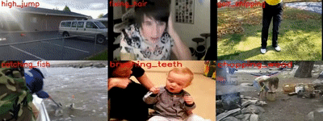

## Introduction
Action recognition is to classify videos containing human actions based on the modeling of the video sequences, with wide application prospects in automatic video analysis, intelligent monitoring, human-computer interaction and so on.  
Existing methods can be divided into two categories, of which 3D CNN based methods can achieve satisfactory results but suffer from huge computational cost, while 2D methods are efficient with relatively poor performance. Thus the key challenge is to design effective and efficient algorithms to capture representative features from videos.  
Our team has been working on human action recognition for years, and proposed a variety of methods, such as linear dynamical system (LDS), tree-pattern graph matching and graph convolutional network.  

## Publications
-	Yuxin Chen, Gaoqun Ma, Chunfeng Yuana, Bing Li, Hui Zhang, Fangshi Wang, and Weiming Hu, “Graph convolutional network with structure pooling and joint-wise channel attention for action recognition,” Pattern Recognition, vol. 103, pp. 107321: 1-13, July 2020.
-	Guan Luo, Jiutong Wei, Weiming Hu, and Stephen J. Maybank, “Tangent Fisher vector on matrix manifolds for action recognition,” IEEE Transactions on Image Processing (TIP), vol. 29, no. 1, pp. 3052-3064, 2020.
-	Hao Yang, ChunfengYuan, BingLi, Yang Du, JunliangXing, Weiming Hu, and Stephen J. Maybank, “Asymmetric 3D convolutional neural networks for action recognition,” Pattern Recognition, vol. 85, pp. 1-12, 2019.
-	Weiming Hu, Baoxin Wu, Pei Wang, Chunfeng Yuan, Yangxi Li, and Stephen Maybank, “Context-dependent random walk graph kernels and tree pattern graph matching kernels with applications to action recognition,” IEEE Transactions on Image Processing (TIP), vol. 27, no. 10, pp. 5060-5075, October. 2018.
-	Yang Du, Chunfeng Yuan, Bing Li, Lili Zhao, Yangxi Li, and Weiming Hu, “Interaction-aware spatio-temporal pyramid attention networks for action classification,” European Conference on Computer Vision (ECCV), pp. 388-404, 2018.
-	Chunfeng Yuan, Baoxin Wu, Xi Li, Weiming Hu*, Stephen Maybank and Fangshi Wang, "Fusing R features and local features with context-aware kernels for action recognition," International Journal of Computer Vision (IJCV), vol. 118, no. 2, pp. 151-171, 2016.
