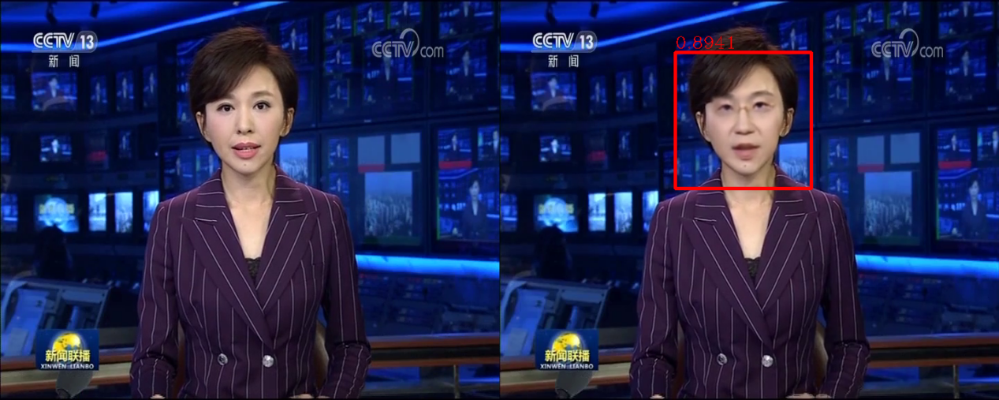

## Introduction
With the swift development of communication technologies, multimedia digital content, consisting of image, video, audio, and text, is growing exponentially and is permeating each aspect of our lives. However, there is much harmful information in multimedia content, such as terrorism, narcotics, racism, violence, privacy-invasion, and illegal-deals, which may lead to severe social turmoil. Thus, it is vital for our society to clean the harmful content on the web, so as to create a beautiful and peaceful world.  
It is challenging to automatically recognize the harmful content, as this requires the computer not only to see the images/videos in depth, but also to fully understand the audio and the text. For several years, VSLab has been devoted to the research around multimedia content security, and has developed many advanced technologies, such as harmful image/video detection, anomaly detection, and face forgery detection.

## Face Forgery Detection
With advances in rendering techniques and deep learning, the manipulation and generation of realistic digital image have been improved much. Computer-generated (CG) images are becoming indistinguishable from photographic (PG) images. In particular, Deepfakes, the face swapping technology mainly based on Generative Adversarial Networks, tries to fit the distribution of real face images and then replaces the faces in a source image with the identity of a specified target while maintaining the attributes such as head poses and facial expressions, which are true to life. It means that fake generated images may be maliciously used to defraud the public. So it is necessary to develop algorithms to identify whether an image is synthetic. CG image forensic task devote to distinguish CG images from PG images. And Face Forgery Detection is specifically aimed at human face scenes.

Existing CG image forensic works still have difficulty in distinguishing high-quality CG images from PG images. The main reasons are that existing benchmarks are out of fashion and methods ignore the underlying texture differences, which are important in this task. To solve this problem, we first construct a large-scale dataset with high diversity and low bias between CG and PG images. Then, a texture-aware CG and PG images classification is also proposed which considers the correlations between filters in the output feature map of a backbone. A mass of experiments demonstrate the effectiveness and superiority of our method.

Similarly, there are three problems in face forgery detection to solve: 1) the forensic methods cannot always maintain a high accuracy rate for unknown synthesis methods, which means their generalization needs to be improved; 2) their detection performance is easily influenced by conventional image processing methods and lacks enough robustness in practical applications; 3) there is no sufficient understanding of the essence of artificial clues used by the forensic methods, so it is difficult to design heuristic strategies. We believe that the commonality such as module structure and post-processing methods should be summarized from the synthesis methods, so that the forensic methods can be designed specifically to make it maintain high accuracy for more types of fake images. Rather than simply treating face forgery detection as an image binary classification problem, we are exploring the relationship between more use of high-level semantics of a face itself and the detection performance, to have a better understanding about the nature of Deepfakes.

<html>
  

    

      
    

    

      
    

  

</html>

## Publications
- Yufan Liu, Minglang Qiao, Mai Xu, Bing Li, Weiming Hu (2020). Learning to predict salient faces: a novel visual-audio saliency model. European Conference on Computer Vision (ECCV).
- Weiming Hu, Jun Gao, Bing Li, Ou Wu, Junping Du, Stephen J. Maybank (2018). Anomaly Detection Using Local Kernel Density Estimation and Context-Based Regression. IEEE Transactions on Knowledge and Data Engineering.
- <a href="/publication/hu-2018-deep" style="color: black">Weiming Hu, Yabo Fan, Junliang Xing, Liang Sun, Zhaoquan Cai, and Stephen Maybank (2018). Deep constrained siamese hash coding network and load-balanced locality-sensitive hashing for near duplicate image detection. IEEE Transactions on Image Processing.</a>
- <a href="/publication/xing-2017-towards" style="color: black">Junliang Xing, Zhiheng Niu, Junshi Huang, Weiming Hu, Xi Zhou, and Shuicheng Yan (2017). Towards robust and accurate multi-view and partially-occluded face alignment. IEEE Transactions on Pattern Analysis and Machine Intelligence.</a>
- <a href="/publication/wu-2016-multimodal" style="color: black">Ou Wu, Haiqiang Zuo, Weiming Hu, Bing Li (2016). Multimodal web aesthetics assessment based on structural SVM and multitask fusion learning. IEEE Transactions on Multimedia.
- <a href="/publication/hu-2015-multi" style="color: black">Weiming Hu, Xinmiao Ding, Bing Li, Jianchao Wang, Yan Gao, Fangshi Wang, Stephen Maybank (2015). Multi-perspective cost-sensitive context-aware multi-instance sparse coding and its application to sensitive video recognition. IEEE Transactions on Multimedia.</a>
