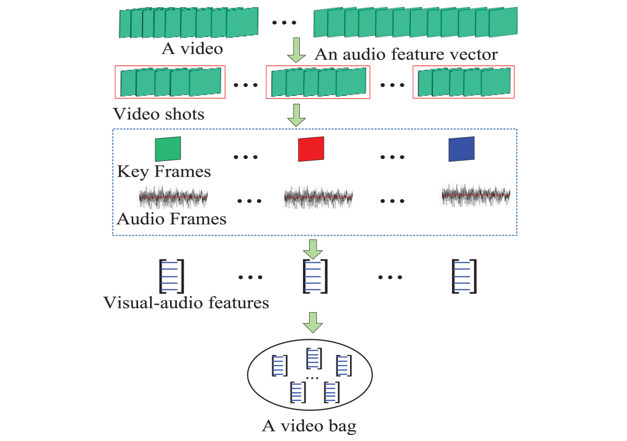

## Introduction
With the swift development of communication technologies, multimedia digital content, consisting of image, video, audio, and text, is growing exponentially and is permeating each aspect of our lives. However, there is much harmful information in multimedia content, such as narcotics, violence, privacy-invasion, and illegal-deals, which may lead to severe social turmoil. Thus, it is vital for our society to clean the harmful content on the web, so as to create a beautiful and peaceful world.  

It is challenging to automatically recognize the harmful content, as this requires the computer not only to see the images/videos in depth, but also to fully understand the audio and the text. For several years, VSLab has been devoted to the research around multimedia content security, and has developed many advanced technologies, such as harmful image/video detection, anomaly detection, and face forgery detection.

## Featured Topics
<html>
  

    

      
    

    

      <h4 class="mb-0 mt-4">
        <a href="/en/subpage/face">Face Forgery Detection</a>
      </h4>
        With advances in rendering techniques and deep learning, the manipulation and generation of realistic digital image have been improved much. Computer-generated (CG) images are becoming indistinguishable from photographic (PG) images. In particular, Deepfakes, the face swapping technology mainly based on Generative Adversarial Networks, tries to fit the distribution of real face images and then replaces the faces in a source image with the identity of a specified target while maintaining the attributes such as head poses and facial expressions, which are true to life. It means that fake generated images may be maliciously used to defraud the public. So it is necessary to develop algorithms to identify whether an image is synthetic. CG image forensic task devote to distinguish CG images from PG images. And Face Forgery Detection is specifically aimed at human face scenes.
    

  

</html>

## Publications
<html>
  

    

      
    

    

      <h4 class="mb-0 mt-4">
        <a href="/en/publication/liu-2020-learning">Learning to predict salient faces: a novel visual-audio saliency model [ECCV2020]</a>
      </h4>
        Recently, video streams have occupied a large proportion of Internet traffic, most of which contain human faces. Hence, it is necessary to predict saliency on multiple-face videos, which can provide attention cues for many content based applications. However, most of multiple-face saliency prediction works only consider visual information and ignore audio, which is not consistent with the naturalistic scenarios. Several behavioral studies have established that sound influences human attention, especially during the speech turn-taking in multipleface videos. In this paper, we thoroughly investigate such influences by establishing a large-scale eye-tracking database of Multiple-face Video in Visual-Audio condition (MVVA). Inspired by the findings of our investigation, we propose a novel multi-modal video saliency model consisting of three branches: visual, audio and face. The visual branch takes the RGB frames as the input and encodes them into visual feature maps. The audio and face branches encode the audio signal and multiple cropped faces, respectively. A fusion module is introduced to integrate the information from three modalities, and to generate the final saliency map.
    

  

</html>

<html>
  

    

      
    

    

      <h4 class="mb-0 mt-4">
        <a href="/en/publication/ding-2020-web">Web objectionable video recognition based on deep multi instance learning with representative prototypes selection [TCSVT2020]</a>
      </h4>
        To protect underage people from accessing objectionable videos in the Internet, an effective objectionable video recognition algorithm is necessary for web filtering. Recently, the multi-instance learning has been introduced for objectionable video recognition and achieves impressive results. However, hand-crafted features as well as redundant and noisy frames in objectionable videos become an intractable problem that inevitably degrades the recognition performance. In this paper, we propose a novel representative prototype selection algorithm embedding deep multi-instance representation learning. In the proposed method, an improved convolutional neural network is designed for multimodal multi-instance feature learning and a self-expressive dictionary learning model based on sparse and low rank constraint is designed to select the representative prototypes from each subspace of instances. Then the bag-level feature is constructed via mapping the bag to the selected prototypes. Experiments on three objectionable video sets show the effectiveness of our method for objectionable video recognition.
    

  

</html>

<html>
  

    

      
    

    

      <h4 class="mb-0 mt-4">
        <a href="/en/publication/hu-2018-deep">Deep constrained siamese hash coding network and load-balanced locality-sensitive hashing for near duplicate image detection [TIP2018]</a>
      </h4>
        We construct a new efficient near duplicate image detection method using a hierarchical hash code learning neural network and load-balanced locality-sensitive hashing (LSH) indexing. We propose a deep constrained siamese hash coding neural network combined with deep feature learning. Our neural network is able to extract effective features for near duplicate image detection. The extracted features are used to construct a LSH-based index. We propose a load-balanced LSH method to produce load-balanced buckets in the hashing process. The load-balanced LSH significantly reduces the query time. Based on the proposed load-balanced LSH, we design an effective and feasible algorithm for near duplicate image detection. Extensive experiments on three benchmark data sets demonstrate the effectiveness of our deep siamese hash encoding network and load-balanced LSH.
    

  

</html>

<html>
  

    

      
    

    

      <h4 class="mb-0 mt-4">
        <a href="/en/publication/hu-2018-anomaly">Anomaly detection using local kernel density estimation and context-based regression [TKDE2018]</a>
      </h4>
        Current local density-based anomaly detection methods are limited in that the local density estimation and the neighborhood density estimation are not accurate enough for complex and large databases, and the detection performance depends on the size parameter of the neighborhood. In this paper, we propose a new kernel function to estimate samples’ local densities and propose a weighted neighborhood density estimation to increase the robustness to changes in the neighborhood size. We further propose a local kernel regression estimator and a hierarchical strategy for combining information from the multiple scale neighborhoods to refine anomaly factors of samples. We apply our general anomaly detection method to image saliency detection by regarding salient pixels in objects as anomalies to the background regions. Local density estimation in the visual feature space and kernel-based saliency score propagation in the image enable the assignment of similar saliency values to homogenous object regions.
    

  

</html>

<html>
  

    

      
    

    

      <h4 class="mb-0 mt-4">
        <a href="/en/publication/wu-2016-multimodal">Multimodal web aesthetics assessment based on structural SVM and multitask fusion learning [TMM2016]</a>
      </h4>
        The overall visual attributes of Web pages significantly influence user experience. A beautiful and well laid out Web page greatly facilitates user access and enhances the browsing experience. In this paper, a new method is proposed to learn an assessment model for the (visual) aesthetics of Web pages. First, multimodal features (structural, local visual, global visual, and functional) of a Web page that are known to significantly affect the aesthetics of a Web page are extracted to construct a feature vector. Second, the interuser disagreement of aesthetics is analyzed and novel aesthetic representations are obtained from the multiuser ratings of a page. A structural learning algorithm is proposed for the new aesthetic representations. Third, as a Web page s functional purpose also affects the perceived aesthetics, we divide Web pages into different types using functional features, and a soft multitask fusion learning strategy is introduced to train assessment models for pages with functional purposes.
    

  

</html>

<html>
  

    

      
    

    

      <h4 class="mb-0 mt-4">
        <a href="/en/publication/hu-2015-multi">Multi-perspective cost-sensitive context-aware multi-instance sparse coding and its application to sensitive video recognition [TMM2015]</a>
      </h4>
        With the development of video-sharing websites, P2P, micro-blog, mobile WAP websites, and so on, sensitive videos can be more easily accessed. Effective sensitive video recognition is necessary for web content security. Among web sensitive videos, this paper focuses on violent and horror videos. Based on color emotion and color harmony theories, we extract visual emotional features from videos. A video is viewed as a bag and each shot in the video is represented by a key frame which is treated as an instance in the bag. Then, we combine multi-instance learning (MIL) with sparse coding to recognize violent and horror videos. The resulting MIL-based model can be updated online to adapt to changing web environments. We propose a cost-sensitive context-aware multi- instance sparse coding (MI-SC) method, in which the contextual structure of the key frames is modeled using a graph, and fusion between audio and visual features is carried out by extending the classic sparse coding into cost-sensitive sparse coding. We then propose a multi-perspective multi- instance joint sparse coding (MI-J-SC) method that handles each bag of instances from an independent perspective, a contextual perspective, and a holistic perspective. The experiments demonstrate that the features with an emotional meaning are effective for violent and horror video recognition, and our cost-sensitive context-aware MI-SC and multi-perspective MI-J-SC methods outperform the traditional MIL methods and the traditional SVM and KNN-based methods.
    

  

</html>
