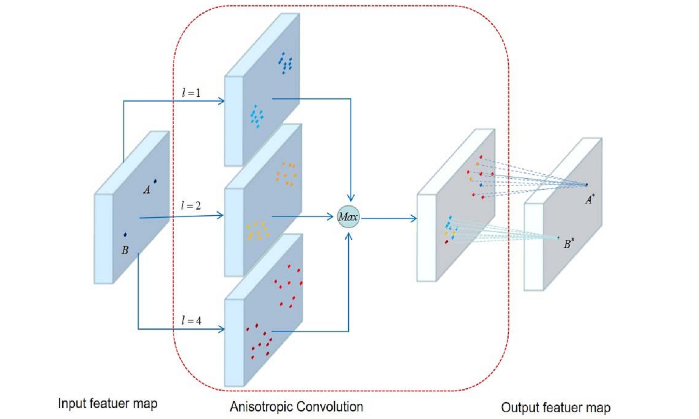

## Introduction
Machine learning is an important branch of artificial intelligence. It focuses on developing algorithms that learn from data automatically, and then utilizing them to predict on unknown data. Today, examples of machine learning are all around us, such as image-to-image search on the web, autorun in response to our voice commands, websites recommend products like movies and songs based on what we bought, watched, or listened to before. Academically, machine learning is a general research field, with a lot of interesting areas such as artificial neural networks, Gaussian process regression, metric learning, hidden Markov model. VSLab has been devoted to machine learning for years, especially in those areas about image and video understanding. Furthermore, the developed algorithms and systems based on our proposed machine learning technologies have been applied into many real-world industrial scenarios successfully. Below we list some featured papers.

## Publications

<html>
  

    

      
    

    

      <h4 class="mb-0 mt-4">
        <a href="/en/publication/hu-2020-dual">Dual L1-normalized context aware tensor power iteration and its applications to multi-object tracking and multi-graph matching [IJCV2020]</a>
      </h4>
        The multi-dimensional assignment problem is universal for data association analysis such as data association-based visual multi-object tracking and multi-graph matching. In this paper, multi-dimensional assignment is formulated as a rank-1 tensor approximation problem. A dual L1-normalized context/hyper-context aware tensor power iteration optimization method is proposed. Experiments on several public datasets, such as the MOT16 challenge benchmark, validate the effectiveness of the proposed methods.
    

  

</html>

<html>
  

    

      
    

    

      <h4 class="mb-0 mt-4">
        <a href="/en/publication/li-2020-anisotropic">Anisotropic convolution for image classification [TIP2020]</a>
      </h4>
        Convolutional neural networks are built upon simple but useful convolution modules. The traditional convolution has a limitation on feature extraction and object localization due to its fixed scale and geometric structure. Besides, the loss of spatial information also restricts the networks performance and depth. To overcome these limitations, this paper proposes a novel anisotropic convolution by adding a scale factor and a shape factor into the traditional convolution. The anisotropic convolution can be applied to arbitrary convolutional networks and the enhanced networks are called ACNs (anisotropic convolutional networks). Experimental results show that ACNs achieve better performance than many state-of-the-art methods and the baseline networks in tasks of image classification and object localization, especially in classification task of tiny images.
    

  

</html>

<html>
  

    

      
    

    

      <h4 class="mb-0 mt-4">
        <a href="/en/publication/luo-2019-tangent">Tangent Fisher vector on matrix manifolds for action recognition [TIP2019]</a>
      </h4>
        In this paper, we address the problem of representing and recognizing human actions from videos on matrix manifolds. For this purpose, we propose a new vector representation method, named tangent Fisher vector, to describe video sequences in the Fisher kernel framework. We first extract dense curved spatio-temporal cuboids from each video sequence. Furthermore, a simple yet efficient algorithm is proposed to learn the LDS parameters and approximate the observability matrix at the same time. Finally a tangent Fisher vector is computed by first accumulating all the tangent vectors in each Gaussian component, and then concatenating the normalized results across all the Gaussian components. A kernel is defined to measure the similarity between tangent Fisher vectors for classification and recognition of a video sequence.
    

  

</html>

<html>
  

    

      
    

    

      <h4 class="mb-0 mt-4">
        <a href="/en/publication/liu-2019-knowledge">Knowledge distillation via instance relationship graph [CVPR2019]</a>
      </h4>
        The key challenge of knowledge distillation is to extract general, moderate and sufficient knowledge from a teacher network to guide a student network. In this paper, a novel Instance Relationship Graph (IRG) is proposed for knowledge distillation. It models three kinds of knowledge, including instance features, instance relationships and feature space transformation, while the latter two kinds of knowledge are neglected by previous methods. The proposed method effectively captures the knowledge along the whole network via IRGs, and thus shows stable convergence and strong robustness to different network architectures. In addition, the proposed method shows superior performance over existing methods on datasets of various scales.
    

  

</html>

<html>
  

    

      
    

    

      <h4 class="mb-0 mt-4">
        <a href="/en/publication/gao-2018-tracking">Tracking-by-fusion via Gaussian process regression extended to transfer learning [TPAMI2018]</a>
      </h4>
        This paper presents a new Gaussian Processes (GPs)-based particle filter tracking framework. The framework non-trivially extends Gaussian process regression (GPR) to transfer learning, and, following the tracking-by-fusion strategy, integrates closely two tracking components, namely a GPs component and a CFs one. Superior performance on four object tracking benchmarks (OTB-2015, Temple-Color, and VOT2015/2016), and in comparison with baselines and recent state-of-the-art trackers, has demonstrated clearly the effectiveness of the proposed framework.
    

  

</html>

<html>
  

    

      
    

    

      <h4 class="mb-0 mt-4">
        <a href="/en/publication/hu-2018-dual">Dual sticky hierarchical Dirichlet process hidden Markov model and its application to natural language description of motions [TPAMI2018]</a>
      </h4>
        In this paper, a new nonparametric Bayesian model called the dual sticky hierarchical Dirichlet process hidden Markov model (HDP-HMM) is proposed for mining activities from a collection of time series data such as trajectories. All the time series data are clustered. Each cluster of time series data, corresponding to a motion pattern, is modeled by an HMM. Our model postulates a set of HMMs that share a common set of states (topics in an analogy with topic models for document processing), but have unique transition distributions. The effectiveness of our dual sticky HDP-HMM is validated on several trajectory datasets. The effectiveness of the natural language descriptions for motions is demonstrated on the vehicle trajectories extracted from a traffic scene.
    

  

</html>
