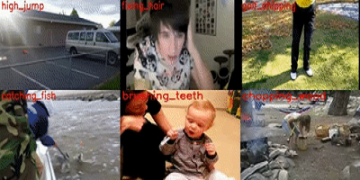

## Introduction
An image can tell a story! A real-world image/video usually contains a lot of entities. These entities, with diverse attributes, obviously/potentially interact with each other, thus constituting multiple complex scenarios. It is very challenging for a computer to fully understand images/videos, because this requires the computer not only to achieve spatial/temporal localization, semantical recognition, and attributive analysis, but also to capture multi-level interactions, even to perform logical reasoning. Recently, a number of interesting tasks have been proposed to facilitate the understanding of images/videos, such as multi-label recognition and image/video caption.  
VSLab has been devoted to those tasks around image/video understanding for years, with many advanced technologies including multi-instance learning, convolutional neural networks, graph neural networks, knowledge distillation, and so on. Below we list some featured papers and give a specific presentation on Video Captioning.

## Featured Topics
<html>
  

    

      
    

    

      <h4 class="mb-0 mt-4">
        <a href="/subpage/videocaption" style="color: black">Video Caption</a>
      </h4>
        Video captioning aims to generate natural language descriptions automatically according to the visual information of given videos by understanding the action and event in the video. There are many wonderful visions of video captioning such as blind assistance and autopilot assistance. Video captioning needs to consider both spatial appearance and temporal dynamics of video contents, which is a promising and challenging task. The key problems in this task are twofold: how to extract discriminative features to represent the contents of videos, and how to leverage the existing visual features to match the corresponding captioning corpus.
    

  

</html>

## Publications
- <a href="/publication/ding-2020-web" style="color: black">Xinmiao Ding, Bing Li, Yangxi Li, Wen Guo, Yao Liu, Weihua Xiong, Weiming Hu (2020). Web Objectionable Video Recognition Based on Deep Multi Instance Learning with Representative Prototypes Selection. IEEE Transactions on Circuits and Systems for Video Technology.</a>
- <a href="/publication/li-2020-anisotropic" style="color: black">Wenjuan Li, Bing Li, Chunfeng Yuan, Yangxi Li, Haohao Wu, Weiming Hu, Fangshi Wang (2020). Anisotropic Convolution for Image Classification. IEEE Transactions on Image Processing.</a>
- <a href="/publication/liu-2019-knowledge" style="color: black">Yufan Liu, Jiajiong Cao, Bing Li, Chunfeng Yuan, Weiming Hu, Yangxi Li, Yunqiang Duan (2019). Knowledge distillation via instance relationship graph. IEEE Conference on Computer Vision and Pattern Recognition (CVPR).</a>
- <a href="/publication/hu-2018-dual" style="color: black">Weiming Hu, Guodong Tian, Yongxin Kang, Chunfeng Yuan, Stephen Maybank (2018). Dual sticky hierarchical Dirichlet process hidden Markov model and its application to natural language description of motions. IEEE transactions on pattern analysis and machine intelligence.</a>
- <a href="/publication/li-2017-multi" style="color: black">Bing Li, Chunfeng Yuan, Weihua Xiong, Weiming Hu, Houwen Peng, Xinmiao Ding, Steve Maybank (2017). Multi-view multi-instance learning based on joint sparse representation and multi-view dictionary learning. IEEE transactions on pattern analysis and machine intelligence.</a>
- <a href="/publication/peng-2016-salient" style="color: black">Houwen Peng, Bing Li, Haibin Ling, Weiming Hu, Weihua Xiong, Stephen J Maybank (2016). Salient object detection via structured matrix decomposition. IEEE transactions on pattern analysis and machine intelligence.</a>
