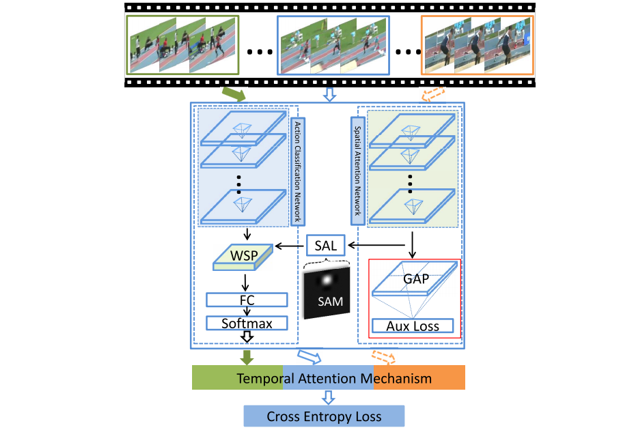
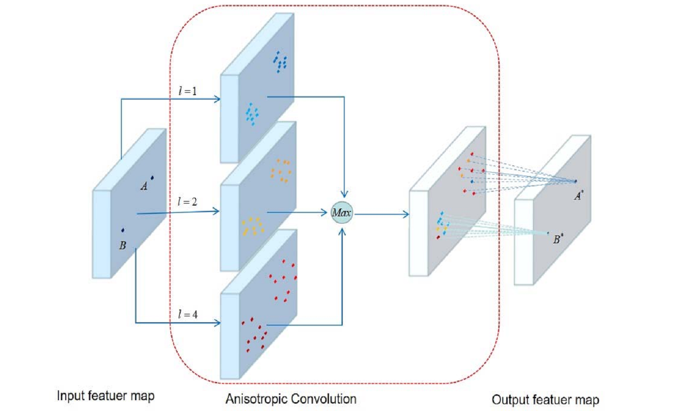
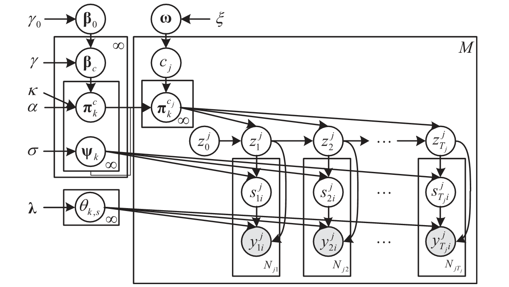
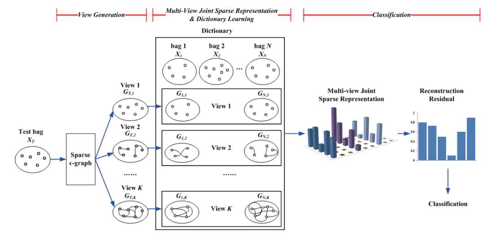
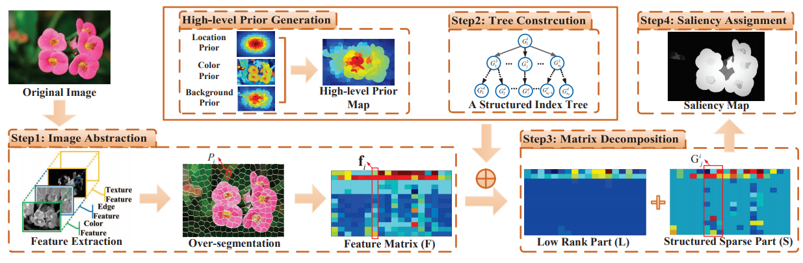

## Introduction
A real-world image/video usually contains a lot of entities. These entities, with diverse attributes, obviously/potentially interact with each other, thus constituting multiple complex scenarios. It is very challenging for a computer to fully understand images/videos, because this requires the computer not only to achieve spatial/temporal localization, semantical recognition, and attributive analysis, but also to capture multi-level interactions, even to perform logical reasoning. Recently, a number of interesting tasks have been proposed to facilitate the understanding of images/videos, such as action recognition, multi-label recognition and image/video caption.  
VSLab has been devoted to those tasks around image/video understanding for years, with many advanced technologies including multi-instance learning, convolutional neural networks, graph neural networks, knowledge distillation, and so on. Below we list some featured papers and give specific presentations on Action Recognition and Video Captioning.

## Featured Topics
<html>
  

    

      
    

    

      <h4 class="mb-0 mt-4">
        <a href="/subpage/actionrecognition">Action Recognition</a>
      </h4>
        Action recognition is to classify videos containing human actions based on the modeling of the video sequences, with wide application prospects in automatic video analysis, intelligent monitoring, human-computer interaction and so on. Existing methods can be divided into two categories, of which 3D CNN based methods can achieve satisfactory results but suffer from huge computational cost, while 2D methods are efficient with relatively poor performance. Thus the key challenge is to design effective and efficient algorithms to capture representative features from videos.
    

  

</html>

<html>
  

    

      
    

    

      <h4 class="mb-0 mt-4">
        <a href="/subpage/videocaption">Video Caption</a>
      </h4>
        Video captioning aims to generate natural language descriptions automatically according to the visual information of given videos by understanding the action and event in the video. There are many wonderful visions of video captioning such as blind assistance and autopilot assistance. Video captioning needs to consider both spatial appearance and temporal dynamics of video contents, which is a promising and challenging task. The key problems in this task are twofold: how to extract discriminative features to represent the contents of videos, and how to leverage the existing visual features to match the corresponding captioning corpus.
    

  

</html>

## Publications
<html>
  

    

      
    

    

      <h4 class="mb-0 mt-4">
        <a href="/publication/yang-2020-sta">STA-CNN: Convolutional spatial-temporal attention learning for action recognition [TIP2020]</a>
      </h4>
        Convolutional Neural Networks have achieved excellent successes for object recognition in still images. However, the improvement of Convolutional Neural Networks over the traditional methods for recognizing actions in videos is not so significant, because the raw videos usually have much more redundant or irrelevant information than still images. In this paper, we propose a Spatial-Temporal Attentive Convolutional Neural Network which selects the discriminative temporal segments and focuses on the informative spatial regions automatically. The STA-CNN model incorporates a Temporal Attention Mechanism and a Spatial Attention Mechanism into a unified convolutional network to recognize actions in videos. The novel Temporal Attention Mechanism automatically mines the discriminative temporal segments from long and noisy videos. The Spatial Attention Mechanism firstly exploits the instantaneous motion information in optical flow features to locate the motion salient regions and it is then trained by an auxiliary classification loss with a Global Average Pooling layer to focus on the discriminative non-motion regions in the video frame. The STA-CNN model achieves the state-of-the-art performance on two of the most challenging datasets, UCF-101 (95.8%) and HMDB-51 (71.5%).
    

  

</html>

<html>
  

    

      
    

    

      <h4 class="mb-0 mt-4">
        <a href="/publication/li-2020-anisotropic">Anisotropic convolution for image classification [TIP2020]</a>
      </h4>
        Convolutional neural networks are built upon simple but useful convolution modules. The traditional convolution has a limitation on feature extraction and object localization due to its fixed scale and geometric structure. Besides, the loss of spatial information also restricts the networks performance and depth. To overcome these limitations, this paper proposes a novel anisotropic convolution by adding a scale factor and a shape factor into the traditional convolution. The anisotropic convolution can be applied to arbitrary convolutional networks and the enhanced networks are called ACNs (anisotropic convolutional networks). Experimental results show that ACNs achieve better performance than many state-of-the-art methods and the baseline networks in tasks of image classification and object localization, especially in classification task of tiny images.
    

  

</html>

<html>
  

    

      
    

    

      <h4 class="mb-0 mt-4">
        <a href="/publication/liu-2019-knowledge">Knowledge distillation via instance relationship graph [CVPR2019]</a>
      </h4>
        The key challenge of knowledge distillation is to extract general, moderate and sufficient knowledge from a teacher network to guide a student network. In this paper, a novel Instance Relationship Graph (IRG) is proposed for knowledge distillation. It models three kinds of knowledge, including instance features, instance relationships and feature space transformation, while the latter two kinds of knowledge are neglected by previous methods. The proposed method effectively captures the knowledge along the whole network via IRGs, and thus shows stable convergence and strong robustness to different network architectures. In addition, the proposed method shows superior performance over existing methods on datasets of various scales.
    

  

</html>

<html>
  

    

      
    

    

      <h4 class="mb-0 mt-4">
        <a href="/publication/hu-2018-dual">Dual sticky hierarchical Dirichlet process hidden Markov model and its application to natural language description of motions [TPAMI2018]</a>
      </h4>
        In this paper, a new nonparametric Bayesian model called the dual sticky hierarchical Dirichlet process hidden Markov model (HDP-HMM) is proposed for mining activities from a collection of time series data such as trajectories. All the time series data are clustered. Each cluster of time series data, corresponding to a motion pattern, is modeled by an HMM. Our model postulates a set of HMMs that share a common set of states (topics in an analogy with topic models for document processing), but have unique transition distributions. The effectiveness of our dual sticky HDP-HMM is validated on several trajectory datasets. The effectiveness of the natural language descriptions for motions is demonstrated on the vehicle trajectories extracted from a traffic scene.
    

  

</html>

<html>
  

    

      
    

    

      <h4 class="mb-0 mt-4">
        <a href="/publication/li-2017-multi">Multi-view multi-instance learning based on joint sparse representation and multi-view dictionary learning [TPAMI2017]</a>
      </h4>
        In multi-instance learning (MIL), the relations among instances in a bag convey important contextual information in many applications. Previous studies on MIL either ignore such relations or simply model them with a fixed graph structure so that the overall performance inevitably degrades in complex environments. To address this problem, this paper proposes a novel multi-view multi-instance learning algorithm (M^2 IL) that combines multiple context structures in a bag into a unified framework.
    

  

</html>

<html>
  

    

      
    

    

      <h4 class="mb-0 mt-4">
        <a href="/publication/peng-2016-salient">Salient object detection via structured matrix decomposition [TPAMI2016]</a>
      </h4>
        Low-rank recovery models have shown potential for salient object detection, where a matrix is decomposed into a low-rank matrix representing image background and a sparse matrix identifying salient objects. Two deficiencies, however, still exist. First, previous work typically assumes the elements in the sparse matrix are mutually independent, ignoring the spatial and pattern relations of image regions. Second, when the low-rank and sparse matrices are relatively coherent, it is difficult for previous models to disentangle them. To address these problems, we propose a novel structured matrix decomposition model with two structural regularizations: (1) a tree-structured sparsity-inducing regularization that captures the image structure and enforces patches from the same object to have similar saliency values, and (2) a Laplacian regularization that enlarges the gaps between salient objects and the background in feature space.
    

  

</html>
