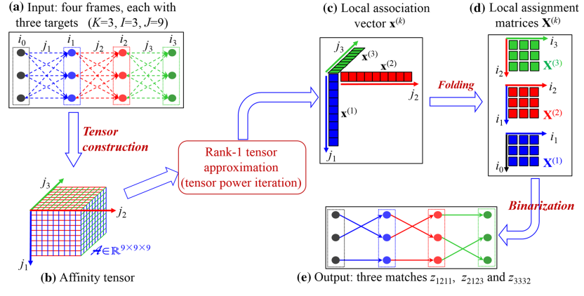

<!--  -->
## Introduction
Object detection, segmentation, tracking are all fundamental tasks in computer vision. Object detection aims to detect instances of semantic objects of a certain class (such as humans, buildings, or cars) in digital images, and visual object tracking (VOT) focuses on estimating the location and scale of a target (or multiple targets) in a video sequence. Beyond representing object locations as rectangle bounding boxes, pixel-level masks can provide more specific location information, namely instance segmentation and video object segmentation (VOS). The above-mentioned technologies are widely used in many fields such as robot navigation, intelligent video surveillance, industrial inspection, and video editing. VSLab has been strenuously working on these fields for many years and has achieved rich results in both theoretical research and practical applications.    
## Competitions
- Visual Object Tracking competition 2018 (VOT2018) realtime track winner (SiamRPN).
- Visual Object Tracking competition 2019 (VOT2019) RGBT track runner-up (SiamDW-T).
- Visual Object Tracking competition 2020 (VOT2020) realtime and base track runner-ups (OcenaPlus).
- Visual Object Tracking competition 2020 (VOT2020) RGBT track winner (SiamDW-T re-submitted by the committee).
## Talks
- Qiang Wang: [SiamMask](https://www.bilibili.com/video/BV1Kt411u7CT?from=search&seid=14223038225505545546)
- Zhipeng Zhang: [Ocean](https://www.bilibili.com/video/BV1354y1e7wU?from=search&seid=10926703456041213142)
## Publications
<html>
  

    

      
    

    

      <h4 class="mb-0 mt-4">
        <a href="/publication/wang-2019-fast" style="color: black">SiamMask: Fast Online Object Tracking and Segmentation: A Unifying Approach [CVPR2019]</a>
      </h4>
        In this paper we illustrate how to perform both visual object tracking and semi-supervised video object segmentation, in real-time, with a single simple approach. Our method, dubbed SiamMask, improves the offline training procedure of popular fully-convolutional Siamese approaches for object tracking by augmenting their loss with a binary segmentation task.
    

  

</html>

<html>
  

    

      
    

    

      <h4 class="mb-0 mt-4">
        <a href="/publication/zhang-2020-ocean" style="color: black">Ocean: Object-aware Anchor-free Tracking [ECCV2020]</a>
      </h4>
        Anchor-based Siamese trackers have achieved remarkable advancements in accuracy, yet the further improvement is restricted by the lagged tracking robustness. We find the underlying reason is that the regression network in anchor-based methods is only trained on the positive anchor boxes. This mechanism makes it difficult to refine the anchors whose overlap with the target objects are small. In this paper, we propose a novel object-aware anchor-free network to address this issue.
    

  

</html>

<html>
  

    

      
    

    

      <h4 class="mb-0 mt-4">
        <a href="/publication/gao-2018-tracking" style="color: black">Tracking-by-Fusion via Gaussian Process Regression Extended to Transfer Learning [TPAMI]</a>
      </h4>
        This paper presents a new Gaussian Processes (GPs)-based particle filter tracking framework. The framework non-trivially extends Gaussian process regression (GPR) to transfer learning, and, following the tracking-by-fusion strategy, integrates closely two tracking components, namely a GPs component and a CFs one.
    

  

</html>

<html>
  

    

      
    

    

      <h4 class="mb-0 mt-4">
        <a href="/publication/wang-2018-learning" style="color: black">Learning Attentions: Residual Attentional Siamese Network for High Performance Online Visual Tracking [CVPR2018]</a>
      </h4>
        Offline training for object tracking has recently shown great potentials in balancing tracking accuracy and speed. However, it is still difficult to adapt an offline trained model to a target tracked online. This work presents a Residual Attentional Siamese Network (RASNet) for high performance object tracking.
    

  

</html>

<html>
  

    

      
    

    

      <h4 class="mb-0 mt-4">
        <a href="/publication/wang-2020-rds-net-an" style="color: black">RDSNet: A New Deep Architecture for Reciprocal Object Detection and Instance Segmentation [AAAI2020]</a>
      </h4>
        Object detection and instance segmentation are two fundamental computer vision tasks. They are closely correlated but their relations have not yet been fully explored in most previous work. This paper presents RDSNet, a novel deep architecture for reciprocal object detection and instance segmentation.
    

  

</html>

<html>
  

    

      
    

    

      <h4 class="mb-0 mt-4">
        <a href="/publication/shi-2019-rank" style="color: black">Rank-1 Tensor Approximation for High-Order Association in Multi-target Tracking [IJCV]</a>
      </h4>
        High-order motion information is important in multi-target tracking (MTT) especially when dealing with large inter-target ambiguities. Such high-order information can be naturallymodeled as amulti dimensional assignment (MDA) problem, whose global solution is however intractable in general. In this paper, we propose a novel framework to the problem by reshaping MTT as a rank-1 tensor approximation problem (R1TA).
    

  

</html>
