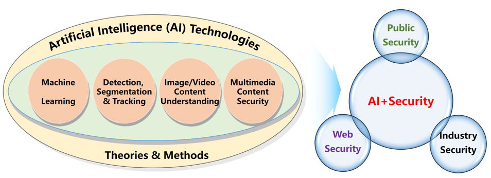

+++
widget = "blank"
headless = true  # This file represents a page section.
active = true  # Activate this widget? true/false
weight = 5  # Order that this section will appear in.
title = ""

[design]
  # Choose how many columns the section has. Valid values: 1 or 2.
  columns = "1"

[design.spacing]
  # Customize the section spacing. Order is top, right, bottom, left.
  padding = ["30px", "150px", "0", "150px"]

[design.background]
  color = "white"

+++
# Introduction
<html>
  

    

      Over the years, VSLab has carried out much high-quality research of fundamental theories and innovative methods around “AI + Security”. Our focused AI technologies can be roughly divided into four research areas: machine learning, detection & segmentation & tracking, image/video content understanding, and multimedia content security. In addition, our developed technologies and systems have been successfully applied into many real-world scenarios, which provides practical guarantee for many aspects of social security, including public security (monitoring), web security (harmful content recognition), industry security (defect detection), and so on. In the future, we will continue to deepen the research around “AI + Security”, academically aiming at making breakthroughs in AI theories and methods while exploring more potential of AI technologies applied into social security.
    

    

      
    

  

</html>

# Projects
