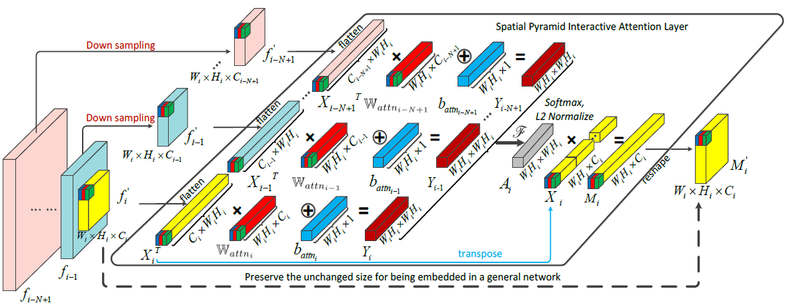
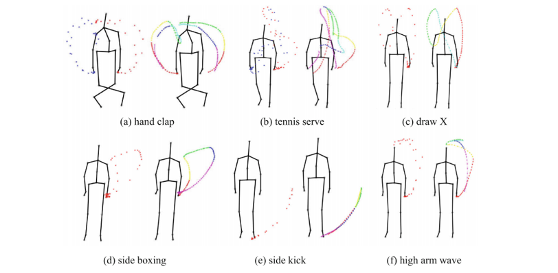
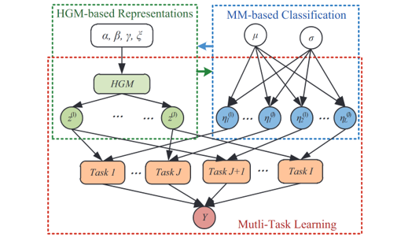
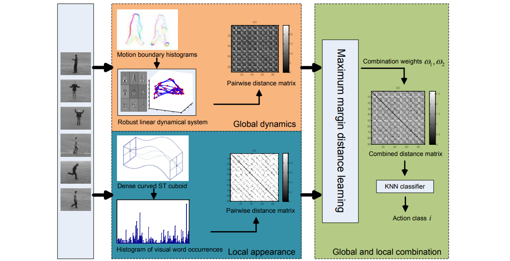

+++
widget = "blank"
headless = true  # This file represents a page section.
active = true  # Activate this widget? true/false
weight = 10  # Order that this section will appear in.
title = ""

[design]
  # Choose how many columns the section has. Valid values: 1 or 2.
  columns = "1"

[design.spacing]
  # Customize the section spacing. Order is top, right, bottom, left.
  padding = ["50px", "100px", "0", "100px"]

[design.background]
  color = "white"

+++
# Action Recognition

<html>
  

    

      
    

    

      

        Action recognition is to classify videos containing human actions based on the modeling of the video sequences, with wide application prospects in automatic video analysis, intelligent monitoring and human-computer interaction. Existing methods can be divided into two categories, of which 3D CNN based methods achieve satisfactory results but suffer from huge computational cost, while 2D methods are efficient with relatively poor performance. Thus the key challenge is to design effective and efficient algorithms to capture representative features from videos.

      

      

        VSLab has been working on human action recognition for years, and proposed a variety of methods, such as linear dynamical system (LDS), tree-pattern graph matching, graph convolutional network and so on.

    

  

</html>

## Publications
<html>
  

    

      
    

    

      <h4 class="mb-0 mt-3">
        <a href="/en/publication/yang-2020-sta">STA-CNN: Convolutional spatial-temporal attention learning for action recognition [TIP2020]</a>
      </h4>
        Convolutional Neural Networks have achieved excellent successes for object recognition in still images. However, the improvement of Convolutional Neural Networks over the traditional methods for recognizing actions in videos is not so significant, because the raw videos usually have much more redundant or irrelevant information than still images. In this paper, we propose a Spatial-Temporal Attentive Convolutional Neural Network which selects the discriminative temporal segments and focuses on the informative spatial regions automatically. The STA-CNN model incorporates a Temporal Attention Mechanism and a Spatial Attention Mechanism into a unified convolutional network to recognize actions in videos. The novel Temporal Attention Mechanism automatically mines the discriminative temporal segments from long and noisy videos. The Spatial Attention Mechanism firstly exploits the instantaneous motion information in optical flow features to locate the motion salient regions and it is then trained by an auxiliary classification loss with a Global Average Pooling layer to focus on the discriminative non-motion regions in the video frame. The STA-CNN model achieves the state-of-the-art performance on two of the most challenging datasets, UCF-101 (95.8%) and HMDB-51 (71.5%).
    

  

</html>

<html>
  

    

      
    

    

      <h4 class="mb-0 mt-0">
        <a href="/en/publication/du-2018-interaction">Interaction-aware spatio-temporal pyramid attention networks for action classification [ECCV2018]</a>
      </h4>
        Local features at neighboring spatial positions in feature maps have high correlation since their receptive fields are often overlapped. Self-attention usually uses the weighted sum with internal elements of each local feature to obtain its weight score, which ignores interactions among local features. To address this, we propose an effective interaction-aware self-attention model inspired by PCA to learn attention maps. Furthermore, since different layers in a deep network capture feature maps of different scales, we use these feature maps to construct a spatial pyramid and then utilize multi-scale information to obtain more accurate attention scores, which are used to weight the local features in all spatial positions of feature maps to calculate attention maps. Moreover, our spatial pyramid attention is unrestricted to the number of its input feature maps so it is easily extended to a spatio-temporal version. Finally, our model is embedded in general CNNs to form end-to-end attention networks for action classification.
    

  

</html>

<html>
  

    

      
    

    

      <h4 class="mb-0 mt-0">
        <a href="/en/publication/du-2018-hierarchical">Hierarchical nonlinear orthogonal adaptive-subspace self-organizing map based feature extraction for human action recognition [AAAI2018]</a>
      </h4>
        Feature extraction is a critical step in the task of action recognition. Hand-crafted features are often restricted because of their fixed forms and deep learning features are more effective but need large-scale labeled data for training. In this paper, we propose a new hierarchical Nonlinear Orthogonal Adaptive-Subspace Self-Organizing Map (NOASSOM) to adaptively and learn effective features from data without supervision. NOASSOM is extended from Adaptive-Subspace Self-Organizing Map (ASSOM) which only deals with linear data and is trained with supervision by the labeled data. Experimental results on widely used datasets show that our method has superior performance than many state-of-the-art hand-crafted features and deep learning features based methods.
    

  

</html>

<html>
  

    

      
    

    

      <h4 class="mb-0 mt-0">
        <a href="/en/publication/wang-2016-graph">Graph based skeleton motion representation and similarity measurement for action recognition [ECCV2016]</a>
      </h4>
        Most of existing skeleton-based representations for action recognition can not effectively capture the spatio-temporal motion characteristics of joints and are not robust enough to noise from depth sensors and estimation errors of joints. In this paper, we propose a novel low-level representation for the motion of each joint through tracking its trajectory and segmenting it into several semantic parts called motionlets. During this process, the disturbance of noise is reduced by trajectory fitting, sampling and segmentation. Then we construct an undirected complete labeled graph to represent a video by combining these motionlets and their spatio-temporal correlations. Furthermore, a new graph kernel called subgraph-pattern graph kernel (SPGK) is proposed to measure the similarity between graphs. Finally, the SPGK is directly used as the kernel of SVM to classify videos. In order to evaluate our method, we perform a series of experiments on several public datasets and our approach achieves a comparable performance to the state-of-the-art approaches.
    

  

</html>

<html>
  

    

      
    

    

      <h4 class="mb-0 mt-0">
        <a href="/en/publication/yang-2015-multi">Multi-feature max-margin hierarchical Bayesian model for action recognition [CVPR2015]</a>
      </h4>
        In this paper, a multi-feature max-margin hierarchical Bayesian model (M3HBM) is proposed for action recognition. Different from existing methods which separate representation and classification into two steps, M3HBM jointly learns a high-level representation by combining a hierarchical generative model (HGM) and discriminative max-margin classifiers in a unified Bayesian framework. Specifically, HGM is proposed to represent actions by distributions over latent spatial temporal patterns (STPs) which are learned from multiple feature modalities and shared among different classes. For recognition, we employ Gibbs classifiers to minimize the expected loss function based on the max-margin principle and use the classifiers as regularization terms of M3HBM to perform Bayeisan estimation for classifier parameters together with the learning of STPs. In addition, multi-task learning is applied to learn the model from multiple feature modalities for different classes. For test videos, we obtain the representations by the inference process and perform action recognition by the learned Gibbs classifiers. For the learning and inference process, we derive an efficient Gibbs sampling algorithm to solve the proposed M3HBM. Extensive experiments on several datasets demonstrate both the representation power and the classification capability of our approach for action recognition.
    

  

</html>

<html>
  

    

      
    

    

      <h4 class="mb-0 mt-0">
        <a href="/en/publication/luo-2014-learning">Learning human actions by combining global dynamics and local appearance [TPAMI2014]</a>
      </h4>
        In this paper, we address the problem of human action recognition through combining global temporal dynamics and local visual spatio-temporal appearance features. For this purpose, in the global temporal dimension, we propose to model the motion dynamics with robust linear dynamical systems (LDSs) and use the model parameters as motion descriptors. Since LDSs live in a non-Euclidean space and the descriptors are in non-vector form, we propose a shift invariant subspace angles based distance to measure the similarity between LDSs. In the local visual dimension, we construct curved spatio-temporal cuboids along the trajectories of densely sampled feature points and describe them using histograms of oriented gradients (HOG). The distance between motion sequences is computed with the Chi-Squared histogram distance in the bag-of-words framework. Finally we perform classification using the maximum margin distance learning method by combining the global dynamic distances and the local visual distances. 
    

  

</html>
