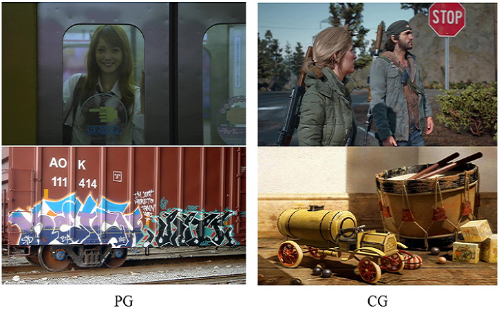

+++
widget = "blank"
headless = true  # This file represents a page section.
active = true  # Activate this widget? true/false
weight = 10  # Order that this section will appear in.
title = ""

[design]
  # Choose how many columns the section has. Valid values: 1 or 2.
  columns = "1"

[design.spacing]
  # Customize the section spacing. Order is top, right, bottom, left.
  padding = ["50px", "100px", "0", "100px"]

[design.background]
  color = "white"

+++
# Face Forgery Detection
&emsp;&emsp;With advances in rendering techniques and deep learning, the manipulation and generation of realistic digital image have been improved much. Computer-generated (CG) images are becoming indistinguishable from photographic (PG) images. In particular, Deepfakes, the face swapping technology mainly based on Generative Adversarial Networks, tries to fit the distribution of real face images and then replaces the faces in a source image with the identity of a specified target while maintaining the attributes such as head poses and facial expressions, which are true to life. It means that fake generated images may be maliciously used to defraud the public. So it is necessary to develop algorithms to identify whether an image is synthetic. CG image forensic task devote to distinguish CG images from PG images. And Face Forgery Detection is specifically aimed at human face scenes.  
&emsp;&emsp;Existing CG image forensic works still have difficulty in distinguishing high-quality CG images from PG images. The main reasons are that existing benchmarks are out of fashion and methods ignore the underlying texture differences, which are important in this task. To solve this problem, we first construct a large-scale dataset with high diversity and low bias between CG and PG images. Then, a texture-aware CG and PG images classification is also proposed which considers the correlations between filters in the output feature map of a backbone. A mass of experiments demonstrate the effectiveness and superiority of our method.  
&emsp;&emsp;Similarly, there are three problems in face forgery detection to solve: 1) the forensic methods cannot always maintain a high accuracy rate for unknown synthesis methods, which means their generalization needs to be improved; 2) their detection performance is easily influenced by conventional image processing methods and lacks enough robustness in practical applications; 3) there is no sufficient understanding of the essence of artificial clues used by the forensic methods, so it is difficult to design heuristic strategies. We believe that the commonality such as module structure and post-processing methods should be summarized from the synthesis methods, so that the forensic methods can be designed specifically to make it maintain high accuracy for more types of fake images. Rather than simply treating face forgery detection as an image binary classification problem, we are exploring the relationship between more use of high-level semantics of a face itself and the detection performance, to have a better understanding about the nature of Deepfakes.

<html>
  

    

      
    

    

      <video src="demo.mp4" width="" height="" controls="controls"></video>
      
Face forgery detection demo (Xiadan Ouyang's and Qiang Gang's faces <a href=https://github.com/deepfakes/faceswap>swapped</a>)

    

  

</html>
