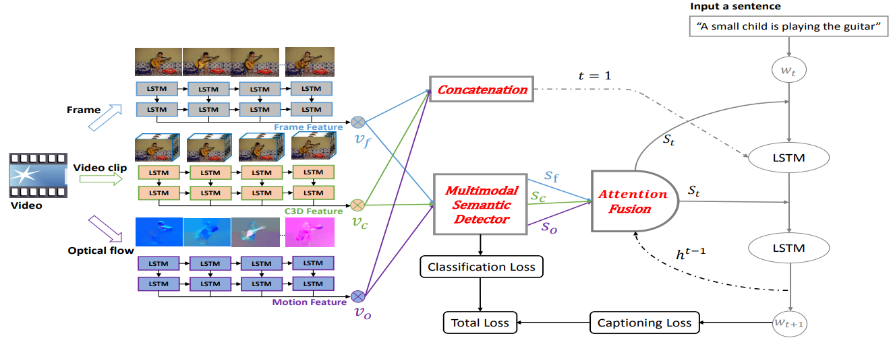

+++
widget = "blank"
headless = true  # This file represents a page section.
active = true  # Activate this widget? true/false
weight = 10  # Order that this section will appear in.
title = ""

[design]
  # Choose how many columns the section has. Valid values: 1 or 2.
  columns = "1"

[design.spacing]
  # Customize the section spacing. Order is top, right, bottom, left.
  padding = ["50px", "100px", "0", "100px"]

[design.background]
  color = "white"

+++
# Video Caption
## Introduction
Video captioning aims to generate natural language descriptions automatically according to the visual information of given videos by understanding the action and event in the video. There are many wonderful visions of video captioning such as blind assistance and autopilot assistance. Video captioning needs to consider both spatial appearance and temporal dynamics of video contents, which is a promising and challenging task. The key problems in this task are twofold: how to extract discriminative features to represent the contents of videos, and how to leverage the existing visual features to match the corresponding captioning corpus. The ultimate aim is to cross the gap between vision and language.  

Previous works, such as S2VT, SA-LSTM, h-RNN, always leverage appearance features of keyframes and motion features of segments to represent video contents. These features extract global information and hard to capture the detailed temporal dynamics of objects in the video. In the topic of video captioning using objects information, we show that the object relational graph can assist the system to enrich partial information during the process of relational reasoning. Furthermore, for such a complex system, the support of external knowledge is very important. Our approach transfers linguistic knowledge to the model by introducing an external language model. With the help of these methods above, we achieve outstanding performance on MSVD, MSR-VTT and VATEX benchmarks.  
## Competitions
- [VATEX Captioning Challenge 2019](https://arxiv.org/pdf/1910.05752.pdf) Chinese and English tracks winner
## Demo
<html>
  

    

      <video src="demo1.mp4" width="" height="" controls="controls"></video>
    

    

      English captions: 
      People are crossing a busy street that is filled with traffic. 
      Someone at a cross walk records vehicles as they drive by. 
      People are standing and waiting to cross the street in a busy city. 
      Several people try to cross the street using a crosswalk as cars drive around a city. 
      People are crossing the street and cars are turning at a busy intersection in a business district. 
      Pedestrians attempt to cross a street at a busy intersection where construction is also taking place. 
      Several cars drive through an intersection as three people wait at the edge of the road to cross the street. 
    

  

</html>

## Featured Publications
<html>
  

    

      
    

    

      <h4 class="mb-0 mt-0">
        <a href="/en/publication/zhang-2020-object">Object relational graph with teacher-recommended learning for video captioning [CVPR2020]</a>
      </h4>
        Taking full advantage of the information from both vision and language is critical for the video captioning task. Existing models lack adequate visual representation due to the neglect of interaction between object, and sufficient training for content-related words due to long-tailed problems. In this paper, we propose a complete video captioning system including both a novel model and an effective training strategy. Experimental evaluations on three benchmarks: MSVD, MSR-VTT and VATEX show the proposed ORG-TRL system achieves state-of-the-art performance. Extensive ablation studies and visualizations illustrate the effectiveness of our system.
    

  

</html>

<html>
  

    

      
    

    

      <h4 class="mb-0 mt-0">
        <a href="/en/publication/sun-2019-multimodal">Multimodal semantic attention network for video captioning [ICME2019]</a>
      </h4>
        Inspired by the fact that different modalities in videos carry complementary information, we propose a Multimodal Semantic Attention Network(MSAN), which is a new encoder-decoder framework incorporating multimodal semantic attributes for video captioning. In the encoding phase, we detect and generate multimodal semantic attributes by formulating it as a multi-label classification problem. Moreover, we add auxiliary classification loss to our model that can obtain more effective visual features and high-level multimodal semantic attribute distributions for sufficient video encoding. In the decoding phase, we extend each weight matrix of the conventional LSTM to an ensemble of attribute-dependent weight matrices, and employ attention mechanism to pay attention to different attributes at each time of the captioning process. We evaluate algorithm on two popular public benchmarks: MSVD and MSR-VTT, achieving competitive results with current state-of-the-art across six evaluation metrics.
    

  

</html>
