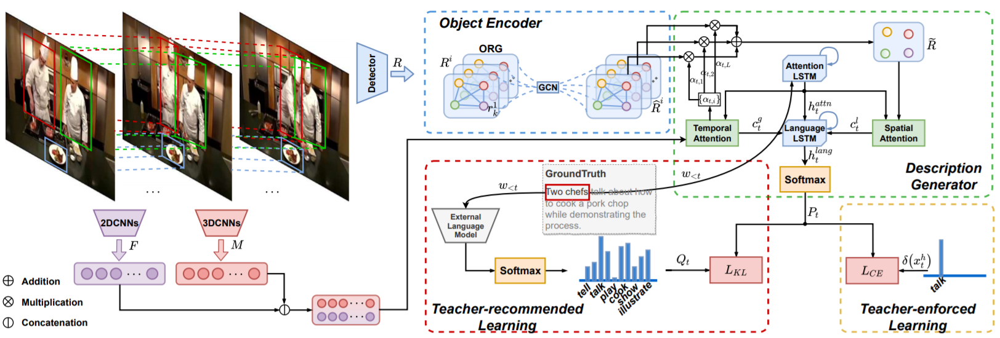

+++
widget = "blank"
headless = true  # This file represents a page section.
active = true  # Activate this widget? true/false
weight = 10  # Order that this section will appear in.
title = ""

[design]
  # Choose how many columns the section has. Valid values: 1 or 2.
  columns = "1"

[design.spacing]
  # Customize the section spacing. Order is top, right, bottom, left.
  padding = ["50px", "100px", "0", "100px"]

[design.background]
  color = "white"

+++
# Video Caption
## Introduction
&emsp;&emsp;Video captioning aims to generate natural language descriptions automatically according to the visual information of given videos by understanding the action and event in the video. There are many wonderful visions of video captioning such as blind assistance and autopilot assistance. Video captioning needs to consider both spatial appearance and temporal dynamics of video contents, which is a promising and challenging task. The key problems in this task are twofold: how to extract discriminative features to represent the contents of videos, and how to leverage the existing visual features to match the corresponding captioning corpus. The ultimate aim is to cross the gap between vision and language.  
&emsp;&emsp;Previous works, such as S2VT, SA-LSTM, h-RNN, always leverage appearance features of keyframes and motion features of segments to represent video contents. These features extract global information and hard to capture the detailed temporal dynamics of objects in the video. In the topic of video captioning using objects information, we show that the object relational graph can assist the system to enrich partial information during the process of relational reasoning. Furthermore, for such a complex system, the support of external knowledge is very important. Our approach transfers linguistic knowledge to the model by introducing an external language model. With the help of these methods above, we achieve outstanding performance on MSVD, MSR-VTT and VATEX benchmarks.  
## Competitions
- VATEX Captioning Challenge 2019 Chinese and English tracks winner
## Demo
<html>
  

    

      <video src="demo1.mp4" width="" height="" controls="controls"></video>
    

    

      English captions: 
      People are crossing the street and cars are turning at a busy intersection in a business district. 
      Pedestrians attempt to cross a street at a busy intersection where construction is also taking place.
    

  

</html>

## Featured Publications
<html>
  

    

      
    

    

      <h4 class="mb-0 mt-0">
        <a href="/publication/zhang-2020-object">Object Relational Graph with Teacher-Recommended Learning for Video Captioning [CVPR2020]</a>
      </h4>
        We propose an object relational graph (ORG) based encoder, which captures more detailed interaction features to enrich visual representation. Meanwhile, we design a teacher-recommended learning (TRL) method to make full use of the successful external language model (ELM) to integrate the abundant linguistic knowledge into the caption model.
    

  

</html>
