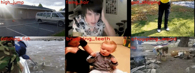

## 简介
行为识别是指根据从包含行为的视频序列中提取特征进行分类，该技术可以应用到很多领域，比如视频分析，智能监控和人机交互等等。  
当前使用的模型主要分为2D CNN 和3D CNN 两大类，但是他们各有优缺点。3D CNN可以实现高的准确率，却是要以巨大的计算成本为代价。2D CNN 虽然计算成本小，但是却损失了准确率。因此，当前的主要挑战是找到一种高效且有效的算法，可以从视频中提取出有代表性的特征。  
针对面临的问题，我们团队在这个领域探索了多年，提出了很多模型和方法，包括CNN，线性动态系统，树模型图匹配，图卷积网络等等。  

## 项目
### 实验室动物行为分析
<video src="demo.mp4" width="" height="" controls="controls"></video>

-	实验室动物行为的观察和分析广泛用于神经科学和药理学研究。大鼠和小鼠是常见的动物模型，可用于研究遗传变异，药物治疗，光遗传学刺激和其他干预措施的行为影响。
-	人工观察记录的成本高昂：实验人员能够同时关注的目标有限，难以长时间连续工作，在动作记录的精确性上也很难保证。
-	自动化检测、定位与分类评估系统可以有效突破上述限制：任意数量目标同时观察，7*24小时连续记录，精确到分秒捕捉全时段动物行为的变化。
-	适配不同的实验环境和动物类型，从小动物（鼠）到大动物（猴），从单目标到群体目标，实时捕捉并输出分析结果。

## 相关论文
-	Yuxin Chen, Gaoqun Ma, Chunfeng Yuana, Bing Li, Hui Zhang, Fangshi Wang, and Weiming Hu, “Graph convolutional network with structure pooling and joint-wise channel attention for action recognition,” Pattern Recognition, vol. 103, pp. 107321: 1-13, July 2020.
-	Guan Luo, Jiutong Wei, Weiming Hu, and Stephen J. Maybank, “Tangent Fisher vector on matrix manifolds for action recognition,” IEEE Transactions on Image Processing (TIP), vol. 29, no. 1, pp. 3052-3064, 2020.
-	Hao Yang, ChunfengYuan, BingLi, Yang Du, JunliangXing, Weiming Hu, and Stephen J. Maybank, “Asymmetric 3D convolutional neural networks for action recognition,” Pattern Recognition, vol. 85, pp. 1-12, 2019.
-	Weiming Hu, Baoxin Wu, Pei Wang, Chunfeng Yuan, Yangxi Li, and Stephen Maybank, “Context-dependent random walk graph kernels and tree pattern graph matching kernels with applications to action recognition,” IEEE Transactions on Image Processing (TIP), vol. 27, no. 10, pp. 5060-5075, October. 2018.
-	Yang Du, Chunfeng Yuan, Bing Li, Lili Zhao, Yangxi Li, and Weiming Hu, “Interaction-aware spatio-temporal pyramid attention networks for action classification,” European Conference on Computer Vision (ECCV), pp. 388-404, 2018.
-	Chunfeng Yuan, Baoxin Wu, Xi Li, Weiming Hu*, Stephen Maybank and Fangshi Wang, "Fusing R features and local features with context-aware kernels for action recognition," International Journal of Computer Vision (IJCV), vol. 118, no. 2, pp. 151-171, 2016.
