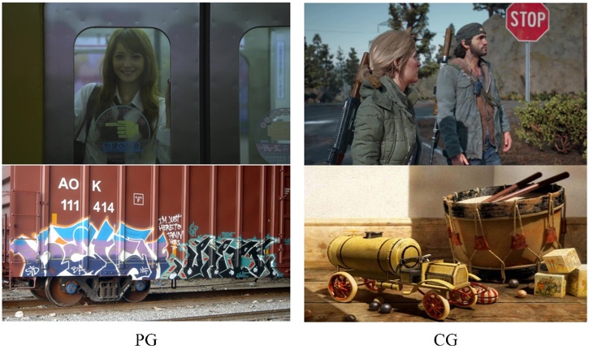
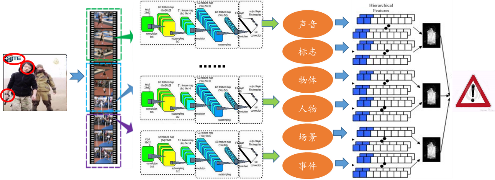
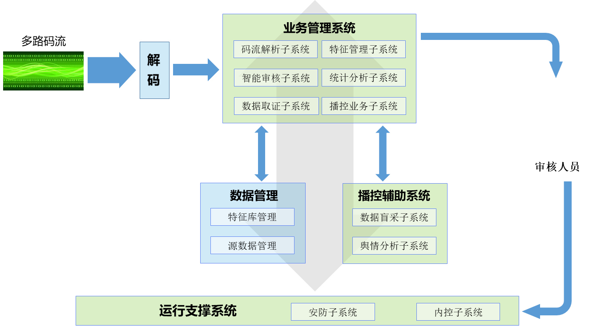
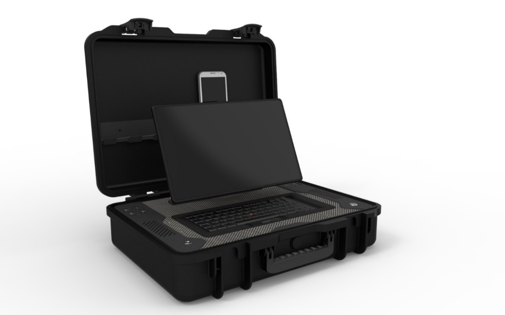
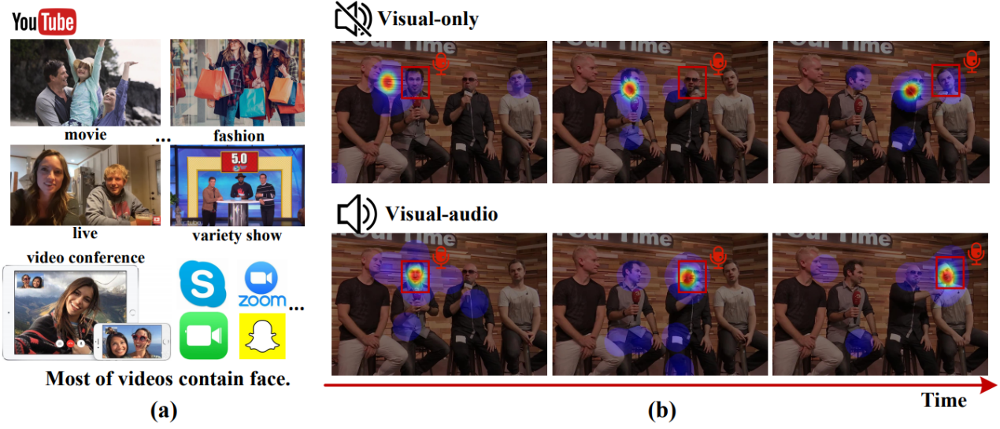
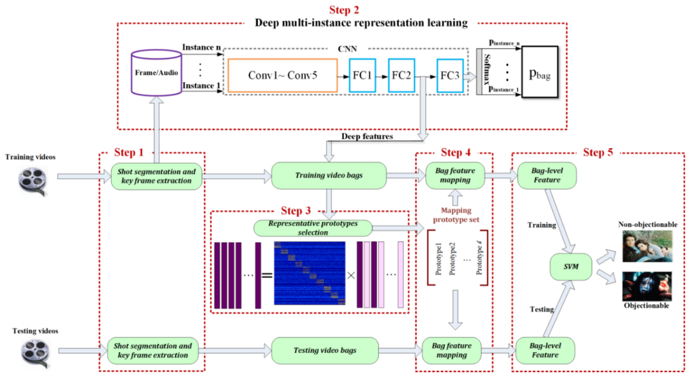
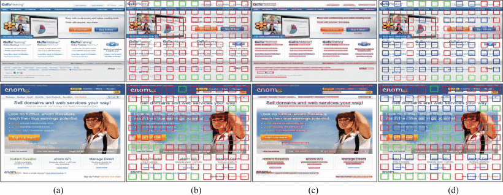
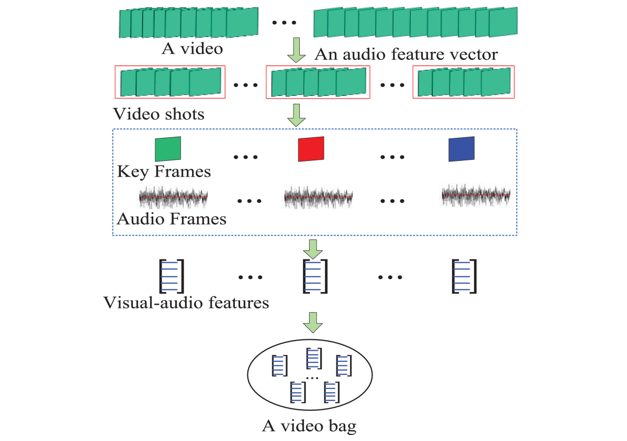

## 简介
&emsp;&emsp;随着通信技术的迅猛发展，图像、视频、音频和文本等多媒体数字内容呈现爆炸式增长的态势，并且这些内容正渗透进我们生活的方方面面。然而，网络多媒体内容中存在着大量不良信息，比如暴力、色情、毒品、隐私侵犯、非法交易、假冒伪劣等，这些有害信息可能会引起社会的剧烈动荡。因此，识别网络上的有害信息、确保多媒体内容安全对社会和平稳定发展至关重要。自动地识别出有害多媒体内容十分具有挑战性，因为这要求计算机不仅能够看懂图片和视频，还要能够充分地理解音频和文本。多年来，VSLab以多媒体内容安全为核心开展了广泛而深入的研究，并开发了多项先进的技术，包括有害图像/视频检测、异常检测以及人脸伪造检测等。

## 专题
<html>
  

    

      
    

    

      <h4 class="mb-0 mt-4">
        <a href="/zh/subpage/face">人脸伪造检测</a>
      </h4>
        随着渲染技术和深度学习的发展，逼真数字图像内容的改动和生成技术取得了突破。计算机生成（CG）图像与摄影（PG）图像之间越来越难以区分。其中深度伪造换脸技术主要借助生成对抗网络拟合真实人脸图像的分布，将一张源图像中的人脸换为指定目标的身份，并且保持姿态、表情等属性不变，达到了以假乱真的程度。合成图像的肆意传播可能会对公众产生误导，因此非常有必要研究相应的算法鉴别图像是否是虚假合成品。CG图像鉴伪任务即主要致力于区分CG和PG图像。特别地，假脸鉴别专门针对人脸场景。
    

  

</html>

## 项目
<html>
  

    

      
    

    

      <h4 class="mb-2 mt-4">
        基于多线索融合的特定视频识别技术
      </h4>
      <ul>
        <li>关键视听觉要素的挖掘与检测:特殊声音、标志、物体、人物、场景、事件</li>
        <li>工程实现及优化:音视频编解码、算法优化、实现与工程化</li>
      </ul>
    

  

</html>

<html>
  

    

      
    

    

      <h4 class="mb-2 mt-4">
        网络视频内容智能监测平台
      </h4>
      <ul>
        <li>主动与被动相结合、取证与监管相结合</li>
        <li>内容智能识别+大数据分析</li>
        <li>完整的解决方案：硬件+软件+基础设施</li>
      </ul>
    

  

</html>

<html>
  

    

      
    

    

      <h4 class="mb-2 mt-4">
        网络多媒体大数据风控平台
      </h4>
      <ul>
        <li>平台数据分布解析</li>
        <li>媒体传播路径跟踪</li>
        <li>趋势预警+来源分析+专项评估</li>
        <li>AI+风控、检索、维稳</li>
      </ul>
    

  

</html>

<html>
  

    

      
    

    

      <h4 class="mb-2 mt-4">
        便携式手机特定内容智能检测箱
      </h4>
      <ul>
        <li>可支持Android/iOS多个版本型号，测试140多种主流的手机型号</li>
        <li>支持多种内嵌式存储器设计标准</li>
        <li>支持基于内容的特定音视频识别</li>
        <li>支持移动硬盘、U盘、笔记本电脑等设备</li>
        <li>不在手机内植入任何程序</li>
      </ul>
    

  

</html>

## 相关论文
<html>
  

    

      
    

    

      <h4 class="mb-0 mt-4">
        <a href="/zh/publication/liu-2020-learning">Learning to predict salient faces: a novel visual-audio saliency model [ECCV2020]</a>
      </h4>
        视频流已经占据了互联网流量的很大一部分，其中大多数包含人脸。因此，在包含多人脸的视频中预测显著性很有必要，这可以为许多基于内容的应用程序提供注意提示。但是，大多数多人脸显著性预测工作仅考虑视觉信息而忽略了音频，这与自然场景不符。多项行为研究已经确定，声音会影响人类的注意力，尤其是在多人脸视频的交替演讲场景中。在本文中，我们通过在可视音频条件下建立大型的多人脸视频眼动追踪数据库（MVVA）来彻底研究此类影响。受调查结果启发，我们提出了一种新颖的多模态视频显著性模型，该模型由视觉，听觉和面部三个分支组成。视觉分支将RGB帧作为输入，并将其编码为视觉特征图。音频和面部分支分别编码音频信号和多个裁剪的面部。引入了融合模块以整合来自三种模态的信息，并生成最终的显著图。实验结果表明，所提出的方法优于11个最新的显著性预测工作，且它的执行方式更接近人类的多模态关注模式。
    

  

</html>

<html>
  

    

      
    

    

      <h4 class="mb-0 mt-4">
        <a href="/zh/publication/ding-2020-web">Web objectionable video recognition based on deep multi instance learning with representative prototypes selection [TCSVT2020]</a>
      </h4>
        为了保护未成年人免于访问网络中不良视频，有效的不良视频识别算法对于Web过滤是必需的。近来，多实例学习已被引入用于不良视频识别，并取得了令人印象深刻的结果。但是，手工设计的特征以及冗余和嘈杂的帧已经成为降低不良视频识别性能的主要因素。在本文中，我们提出了一种新颖的具有代表性的原型选择算法，该算法嵌入了深度多实例表示学习。该方法为多模态多实例特征学习设计了一种改进的卷积神经网络，并设计了一种基于稀疏和低秩约束的自表达词典学习模型，以从实例的每个子空间中选择具有代表性的原型。然后，通过将袋子映射到选定的原型来构造袋子级别的特征。在三个不良视频集上进行的实验表明，我们的方法可以有效地识别不良视频。
    

  

</html>

<html>
  

    

      
    

    

      <h4 class="mb-0 mt-4">
        <a href="/zh/publication/hu-2018-deep">Deep constrained siamese hash coding network and load-balanced locality-sensitive hashing for near duplicate image detection [TIP2018]</a>
      </h4>
        我们使用分层哈希编码学习神经网络和负载平衡的局部敏感哈希（LSH）索引，构造了一种新的有效的近邻重复图像检测方法。 我们提出了结合深度特征学习的深度约束暹罗哈希编码神经网络。 我们的神经网络能够提取有效特征以进行近邻重复的图像检测。 提取的特征用于构建基于LSH的索引。 我们提出了一种负载平衡的LSH方法，在哈希过程中生成负载平衡的存储桶。 负载平衡的LSH大大减少了查询时间。 基于提出的负载均衡LSH，我们设计了一种有效且可行的算法，用于近邻重复图像检测。 在三个基准数据集上进行的广泛实验证明了我们的深度暹罗哈希编码网络和负载平衡LSH的有效性。
    

  

</html>

<html>
  

    

      
    

    

      <h4 class="mb-0 mt-4">
        <a href="/zh/publication/wu-2016-multimodal">Multimodal web aesthetics assessment based on structural SVM and multitask fusion learning [TMM2016]</a>
      </h4>
        网页的整体视觉属性（例如美学）显著影响用户体验。美观且布局合理的网页极大地方便了用户访问并增强了浏览体验。本文提出了一种新的方法来学习网页（视觉）美感的评估模型。首先，提取已知会严重影响网页美学的网页多峰特征（结构，局部视觉，全局视觉和功能）以构建特征向量。其次，分析了用户之间的美学差异，并从页面的多用户评级中获得了新颖的美学表示。针对新的美学表现，提出了一种结构学习算法。第三，由于网页的功能目的也影响感知的美观度，因此我们使用功能特征将网页分为不同类型，并引入了软多任务融合学习策略来训练具有功能目的的页面评估模型。实验结果证明了我们方法的有效性：1）结构，局部和全局视觉功能的组合优于现有的最新Web美学功能； 2）提出的结构学习算法在新的美学表现形式上取得了良好的效果； 3）提出的软多任务融合学习策略提高了美学评估模型的性能。
    

  

</html>

<html>
  

    

      
    

    

      <h4 class="mb-0 mt-4">
        <a href="/zh/publication/hu-2015-multi">Multi-perspective cost-sensitive context-aware multi-instance sparse coding and its application to sensitive video recognition [TMM2015]</a>
      </h4>
        随着视频共享网站，P2P，微博，移动WAP网站等的发展，可以更轻松地访问敏感视频。有效的敏感视频识别对于Web内容安全是必要的。在网络敏感视频中，本文重点介绍暴力和恐怖视频。基于色彩情感和色彩和谐理论，我们从视频中提取视觉情感特征。视频被视为包，视频中的每个镜头均由关键帧表示，该关键帧被视为包中的实例。然后，我们将多实例学习（MIL）与稀疏编码结合起来，以识别暴力和恐怖视频。生成的基于MIL的模型可以在线更新以适应不断变化的Web环境。我们提出了一种成本敏感的上下文感知多实例稀疏编码（MI-SC）方法，其中，关键帧的上下文结构使用图形建模，并且通过扩展经典模型来实现音频和视觉功能之间的融合将稀疏编码转换为对成本敏感的稀疏编码。然后，我们提出了一种多角度的多实例联合稀疏编码（MI-J-SC）方法，该方法从独立的角度，上下文的角度和整体的角度处理每个实例包。实验表明，具有情感意义的特征对于暴力和恐怖视频识别是有效的，并且我们的成本敏感型上下文感知MI-SC和多角度MI-J-SC方法优于传统的MIL方法和传统的SVM和基于KNN的方法。
    

  

</html>
