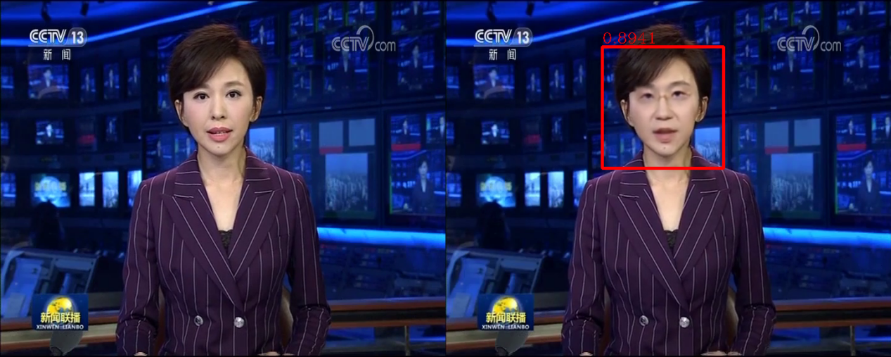

## 简介
随着通信技术的迅猛发展，图像、视频、音频和文本等多媒体数字内容呈现爆炸式增长的态势，并且这些内容正渗透进我们生活的方方面面。然而，网络多媒体内容中存在着大量不良信息，比如恐怖主义、暴力、色情、毒品、种族歧视、隐私侵犯、非法交易、假冒伪劣等，这些有害信息可能会引起社会的剧烈动荡。因此，监管和清理网络上的有害信息、确保多媒体内容安全对社会和平稳定发展至关重要。  
自动地识别出有害多媒体内容十分具有挑战性，因为这要求计算机不仅能够看懂图片和视频，还要能够充分地理解音频和文本。多年来，VSLab以多媒体内容安全为核心开展了广泛而深入的研究，并开发了多项先进的技术，包括有害图像/视频检测、异常检测以及人脸伪造检测等。

## 人脸伪造检测
随着渲染技术和深度学习的发展，逼真数字图像内容的改动和生成技术取得了突破。计算机生成（CG）图像与摄影（PG）图像之间越来越难以区分。其中深度伪造换脸技术主要借助生成对抗网络拟合真实人脸图像的分布，将一张源图像中的人脸换为指定目标的身份，并且保持姿态、表情等属性不变，达到了以假乱真的程度。合成图像的肆意传播可能会对公众产生误导，因此非常有必要研究相应的算法鉴别图像是否是虚假合成品。CG图像鉴伪任务即主要致力于区分CG和PG图像。特别地，假脸鉴别专门针对人脸场景。  
现有的CG图像鉴伪工作在区分高质量的CG图像和PG图像方面仍然存在困难。主要原因是现有的数据集已经过时，并且鉴伪方法忽略了底层纹理的差异等重要信息。为了解决该问题，我们首先构建一个具有高多样性和低偏差的CG和PG图像大规模数据集。在此基础上，提出了一种纹理感知的CG和PG图像分类方法，该方法考虑了主干特征图输出中滤波器之间的相关性。大量的实验证明了其有效性。  
同样，假脸鉴别方法也存在待解决问题：一是鉴别算法不易对未知新型造假方法保持较高的检测准确率，即泛化性能不足。二是鉴别算法的性能容易受到常规图像处理手段的干扰，在实际应用中缺乏鲁棒性。三是对伪造线索的本质认识不足，鉴别算法所习得的鉴伪依据尚无明确的解释，因此难以设计启发式策略。我们认为应从造假手段中总结共性，例如相同的模块结构、后处理方法等，由此针对性地设计检测方案，使之对更多造假类型都具备高准确率。我们正探究更多地利用脸部本身所携带的高层语义对鉴别效果有何种影响，期望对人脸伪造问题的本质有更深刻认识。

<html>
  

    

      
    

    

      
    

  

</html>

## 项目
<html>
  

    

      
    

    

      <h3 class="mb-2 mt-4">
        基于多线索融合的暴恐视频识别技术
      </h3>
      <ul>
        <li>关键视听觉要素的挖掘与检测:特殊声音、标志、物体、人物、场景、事件</li>
        <li>工程实现及优化:音视频编解码、算法优化、实现与工程化</li>
      </ul>
    

  

</html>

<html>
  

    

      
    

    

      <h3 class="mb-2 mt-4">
        网络视频内容智能监测平台
      </h3>
      <ul>
        <li>主动与被动相结合、取证与监管相结合</li>
        <li>内容智能识别+大数据分析</li>
        <li>完整的解决方案：硬件+软件+基础设施</li>
      </ul>
    

  

</html>

<html>
  

    

      
    

    

      <h3 class="mb-2 mt-4">
        网络多媒体大数据风控平台
      </h3>
      <ul>
        <li>平台数据分布解析</li>
        <li>媒体传播路径跟踪</li>
        <li>趋势预警+来源分析+专项评估</li>
        <li>AI+风控、检索、维稳</li>
      </ul>
    

  

</html>

<html>
  

    

      
    

    

      <h3 class="mb-2 mt-4">
        便携式手机涉恐内容智能检测箱
      </h3>
      <ul>
        <li>可支持Android/iOS多个版本型号，测试140多种主流的手机型号</li>
        <li>支持多种内嵌式存储器设计标准</li>
        <li>支持基于内容的暴恐音视频识别</li>
        <li>支持移动硬盘、U盘、笔记本电脑等设备</li>
        <li>不在手机内植入任何程序</li>
      </ul>
    

  

</html>

## 相关论文
- Yufan Liu, Minglang Qiao, Mai Xu, Bing Li, Weiming Hu (2020). Learning to predict salient faces: a novel visual-audio saliency model. European Conference on Computer Vision (ECCV).
- Weiming Hu, Jun Gao, Bing Li, Ou Wu, Junping Du, Stephen J. Maybank (2018). Anomaly Detection Using Local Kernel Density Estimation and Context-Based Regression. IEEE Transactions on Knowledge and Data Engineering.
- <a href="/publication/hu-2018-deep" style="color: black">Weiming Hu, Yabo Fan, Junliang Xing, Liang Sun, Zhaoquan Cai, and Stephen Maybank (2018). Deep constrained siamese hash coding network and load-balanced locality-sensitive hashing for near duplicate image detection. IEEE Transactions on Image Processing.</a>
- <a href="/publication/xing-2017-towards" style="color: black">Junliang Xing, Zhiheng Niu, Junshi Huang, Weiming Hu, Xi Zhou, and Shuicheng Yan (2017). Towards robust and accurate multi-view and partially-occluded face alignment. IEEE Transactions on Pattern Analysis and Machine Intelligence.</a>
- <a href="/publication/wu-2016-multimodal" style="color: black">Ou Wu, Haiqiang Zuo, Weiming Hu, Bing Li (2016). Multimodal web aesthetics assessment based on structural SVM and multitask fusion learning. IEEE Transactions on Multimedia.
- <a href="/publication/hu-2015-multi" style="color: black">Weiming Hu, Xinmiao Ding, Bing Li, Jianchao Wang, Yan Gao, Fangshi Wang, Stephen Maybank (2015). Multi-perspective cost-sensitive context-aware multi-instance sparse coding and its application to sensitive video recognition. IEEE Transactions on Multimedia.</a>
