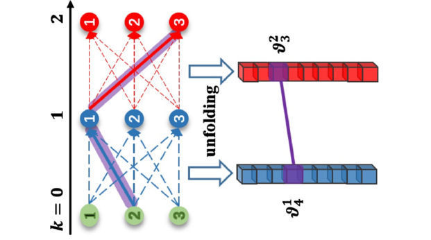
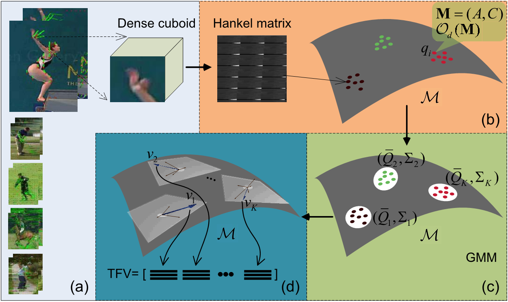
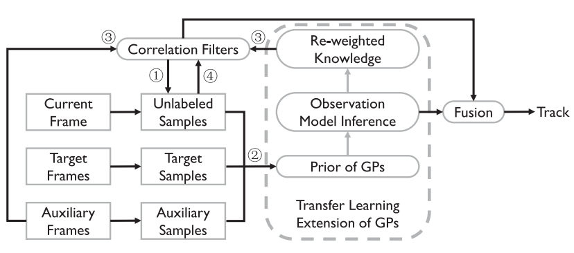

## 简介
&emsp;&emsp;机器学习是人工智能的一个重要分支，旨在研究能够自动从数据中学习的算法，并利用这些算法对未知数据进行预测。当前，机器学习的现实应用十分广泛，例如网络上的以图搜图，声控下的自动执行，基于我们购买、观看或聆听历史的网络推荐产品等等。学术研究上，机器学习是一个相当宽泛的研究领域，有着许多广受关注的研究方向，如人工神经网络、高斯过程回归、度量学习、隐马尔可夫模型等。VSLab研究机器学习已有数年，尤其在图像和视频理解相关的方向上研究较为深入。并且，我们所研发的机器学习算法和系统已成功地应用于多个现实场景中。下面呈现部分特色论文。

## 相关论文

<html>
  

    

      
    

    

      <h4 class="mb-0 mt-4">
        <a href="/publication/hu-2020-dual">Dual L1-normalized context aware tensor power iteration and its applications to multi-object tracking and multi-graph matching [IJCV2020]</a>
      </h4>
        多维分配问题普遍存在于数据关联分析中，例如基于数据关联的多对象跟踪和多图匹配。在本文中，多维分配被建模为rank-1张量估计问题。提出了一种双L1归一化的上下文/超上下文感知张量幂迭代优化方法。该方法适用于多目标跟踪和多图匹配。在优化方法中，具有双单位范数的张量幂迭代可实现跨多个样本集的信息捕获。样本关联之间的交互被建模为上下文或超上下文，它们与全局亲和力组合在一起形成统一的优化。优化可以灵活地适应各种类型的上下文模型。在多对象跟踪中，根据在不同帧中检测到的对象之间的外观相似性来定义全局亲和力。对象之间的交互被建模为运动上下文，该运动上下文被编码为全局关联优化。跟踪方法集成了高阶运动信息和高阶外观变化。多图匹配方法同时对图顶点进行匹配，并对图边缘进行结构匹配。跨多图的匹配一致性基于高阶张量优化。各种类型的顶点亲和力和边缘/超边缘亲和力可以灵活集成。
    

  

</html>

<html>
  

    

      
    

    

      <h4 class="mb-0 mt-4">
        <a href="/publication/li-2020-anisotropic">Anisotropic convolution for image classification [TIP2020]</a>
      </h4>
        卷积神经网络建立在简单但有用的卷积模块上。传统的卷积因其固定的比例和几何结构而在特征提取和对象定位方面受到限制。此外，空间信息的丢失也限制了网络的性能和深度。为了克服这些限制，本文提出了一种新颖的各向异性卷积，方法是在传统卷积中添加比例因子和形状因子。各向异性卷积根据对象的有效大小灵活而动态地增强了感受野。另外，各向异性卷积是广义卷积。传统卷积，膨胀卷积和可变形卷积可以视为其特殊情况。此外，为了提高训练效率并避免陷入局部最优，本文介绍了各向异性卷积的简化实现。各向异性卷积可以应用于任意卷积网络，增强型网络称为ACN，实验结果表明，在图像分类和对象定位任务中，尤其是在微小图像的分类任务中，ACN的性能优于许多最新方法和基准网络。
    

  

</html>

<html>
  

    

      
    

    

      <h4 class="mb-0 mt-4">
        <a href="/publication/luo-2019-tangent">Tangent Fisher vector on matrix manifolds for action recognition [TIP2019]</a>
      </h4>
        在本文中，我们解决了基于矩阵流形的视频表示和识别人类动作的问题。为此，我们提出了一种称为Tangent Fisher向量的新矢量表示方法，以描述Fisher Kernel框架中的视频序列。我们首先从每个视频序列中提取密集的弯曲时空长方体，与传统的直长方体相比，密集的弯曲时空长方体包含更多的局部运动信息。然后使用线性动力学系统（LDS）来描述每个长方体，以同时捕获局部外观和运动。此外，提出了一种简单而有效的算法来学习LDS参数并同时估计可观察性矩阵。每个视频序列由一组LDS表示，考虑到每个LDS都可以看作是Grassmann流形中的一个点，因此我们提出学习流形上的内在GMM以对LDS点进行聚类。最后，首先通过累加每个高斯分量中的所有切向量，然后将所有高斯分量上的归一化结果进行级联，来计算出Tangent Fisher向量，并定义了一个内核，以测量Tangent Fisher向量之间的相似性，以对视频序列进行分类和识别。
    

  

</html>

<html>
  

    

      
    

    

      <h4 class="mb-0 mt-4">
        <a href="/publication/liu-2019-knowledge">Knowledge distillation via instance relationship graph [CVPR2019]</a>
      </h4>
        知识蒸馏的关键挑战是从教师网络中提取通用、合理和足够的知识，以指导学生网络。本文提出了一种新的实例关系图（IRG）进行知识提取。它对三种知识进行建模，包括实例特征，实例关系和特征空间转换，其中后两种知识往往被先前的方法所忽略。首先，通过将实例特征和实例关系分别视为顶点和边，构造IRG来建模一个网络层的知识。其次，提出了一个IRG变换来建模跨层的特征空间变换，它比直接模仿中间层的特征要更为合理。最后，hint损失函数旨在迫使学生IRG模仿教师IRG的结构。所提出的方法通过IRG有效地捕获了整个网络的知识，从而对不同的网络体系结构显示出稳定的收敛性和强大的鲁棒性。此外，所提出的方法在各种规模的数据集上均表现出优于现有方法的性能。
    

  

</html>

<html>
  

    

      
    

    

      <h4 class="mb-0 mt-4">
        <a href="/publication/gao-2018-tracking">Tracking-by-fusion via Gaussian process regression extended to transfer learning [TPAMI2018]</a>
      </h4>
        本文提出了一个基于高斯过程（GPs）的粒子过滤器跟踪框架。该框架将高斯过程回归（GPR）应用到迁移学习中。根据融合-跟踪的策略，我们引入了GPs和CFs两个跟踪模块。GP模块通过利用高斯过程来分析和建模目标外观的概率分布。它将标记的样本分为辅助样本和目标样本，并在迁移学习中探索未标记的样本。因此，GPs模块会随时间增加捕获目标样本上丰富的外观信息。另一方面，通过粒子滤波方法对高可能性区域中的初始粒子集进行采样，我们集成了功能强大而有效的相关滤波器，即CFs模块。CFs模块不仅提高了采样质量，还受益于GPs模块提供的重新加权的知识作为潜在变量，用于确定辅助样本中每个相关滤波器模板的影响。
    

  

</html>

<html>
  

    

      
    

    

      <h4 class="mb-0 mt-4">
        <a href="/publication/hu-2018-dual">Dual sticky hierarchical Dirichlet process hidden Markov model and its application to natural language description of motions [TPAMI2018]</a>
      </h4>
      本文提出了一种新的非参数贝叶斯模型，称为双重粘性分层Dirichlet过程隐马尔可夫模型（HDP-HMM），用于从一系列时间序列数据（例如轨迹）中进行挖掘。HMM对与运动模式相对应的每个时间序列数据簇进行建模。我们的模型假设一组HMM具有相同的状态集（类似于用于文档处理的主题模型的主题），但是具有唯一的过渡分布。 HMM的数量和主题的数量都是自动确定的。粘性先验避免了冗余状态，使我们的HDP-HMM更有效地为多模式观测建模。对于运动轨迹建模的应用，主题对应于运动活动。学到的主题被聚集成原子活动，并为其分配谓词。我们提出一种贝叶斯推理方法，将给定的轨迹分解为一系列原子活动。场景中的源和汇是通过对轨迹的端点（起点和终点）进行聚类来学习的。使用轨迹中的点学习语义运动区域。将学习到的源和接收器，学习到的语义运动区域和学习到的原子活动序列组合在一起时，可以用自然语言尽可能自动地描述由轨迹表示的动作。我们的双粘性HDP-HMM的有效性在几个轨迹数据集上得到了验证。从交通场景中提取的车辆轨迹证明了自然语言描述对运动的有效性。
    

  

</html>
