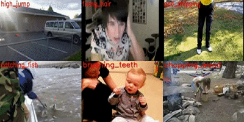

## 简介
看图说话，一幅图像甚至能告诉我们一个美丽的故事。在现实世界中，一幅图像/一段视频通常包含多个物体，这些物体有着非常丰富的颜色、形状和质地等属性，并且彼此间可能还存在着显式或隐式的相互作用，由此构成了多种复杂的场景和情境。让计算机充分地理解图像/视频是一件十分具有挑战性的事情，因为这要求计算机不仅能够实现空域/时域定位，语义识别以及属性分析，还要能够捕获多层次的实体交互，甚至要执行高层次的逻辑推理。近年来，学术界提出了一些研究任务来促进图像/视频的全面深入理解，比如多标签识别和图像/视频描述。  
VSLab钻研图像/视频理解相关任务已有数年，在前沿技术方向上有着深入的研究基础，包括多示例学习、卷积神经网络、图神经网络、知识蒸馏等等。下面列出一些VSLab的代表性学术论文，并以视频描述（Video Caption）任务为例进行专题呈现。

## 专题
<html>
  

    

      
    

    

      <h4 class="mb-0 mt-4">
        <a href="/zh/subpage/videocaption" style="color: black">视频描述</a>
      </h4>
        视频描述是“视觉-语言”研究中最重要的一类生成式任务。通过对给定视频中动作和事件等内容的理解，自动地去生成符合人类语言习惯的描述。有很多非常有前景的应用，例如助盲系统可以帮助盲人读出这个世界，自动驾驶辅助系统可以帮助司机更好地判断路况。视频描述需要充分地利用视频中静止的表观信息和动态的运动信息，同时还需要跨越视觉-语言的鸿沟。因此两个重要的问题：一是如何更好地融合和利用视频中的多模态信息，以及如何将视觉信息和生成的语言匹配起来，是该任务需要解决的。
    

  

</html>

## 相关论文
- <a href="/publication/ding-2020-web" style="color: black">Xinmiao Ding, Bing Li, Yangxi Li, Wen Guo, Yao Liu, Weihua Xiong, Weiming Hu (2020). Web Objectionable Video Recognition Based on Deep Multi Instance Learning with Representative Prototypes Selection. IEEE Transactions on Circuits and Systems for Video Technology.</a>
- <a href="/publication/li-2020-anisotropic" style="color: black">Wenjuan Li, Bing Li, Chunfeng Yuan, Yangxi Li, Haohao Wu, Weiming Hu, Fangshi Wang (2020). Anisotropic Convolution for Image Classification. IEEE Transactions on Image Processing.</a>
- <a href="/publication/liu-2019-knowledge" style="color: black">Yufan Liu, Jiajiong Cao, Bing Li, Chunfeng Yuan, Weiming Hu, Yangxi Li, Yunqiang Duan (2019). Knowledge distillation via instance relationship graph. IEEE Conference on Computer Vision and Pattern Recognition (CVPR).</a>
- <a href="/publication/hu-2018-dual" style="color: black">Weiming Hu, Guodong Tian, Yongxin Kang, Chunfeng Yuan, Stephen Maybank (2018). Dual sticky hierarchical Dirichlet process hidden Markov model and its application to natural language description of motions. IEEE transactions on pattern analysis and machine intelligence.</a>
- <a href="/publication/li-2017-multi" style="color: black">Bing Li, Chunfeng Yuan, Weihua Xiong, Weiming Hu, Houwen Peng, Xinmiao Ding, Steve Maybank (2017). Multi-view multi-instance learning based on joint sparse representation and multi-view dictionary learning. IEEE transactions on pattern analysis and machine intelligence.</a>
- <a href="/publication/peng-2016-salient" style="color: black">Houwen Peng, Bing Li, Haibin Ling, Weiming Hu, Weihua Xiong, Stephen J Maybank (2016). Salient object detection via structured matrix decomposition. IEEE transactions on pattern analysis and machine intelligence.</a>
