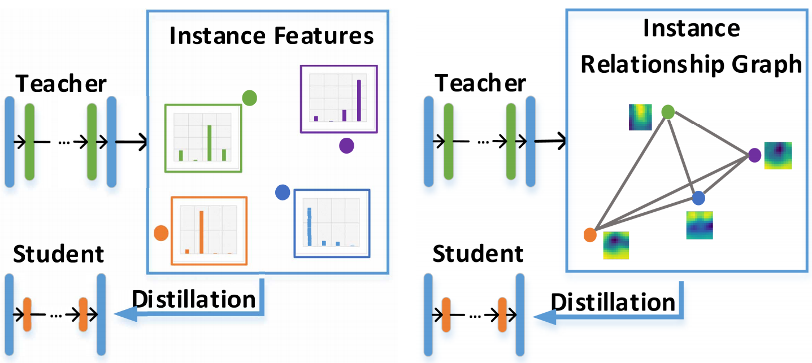
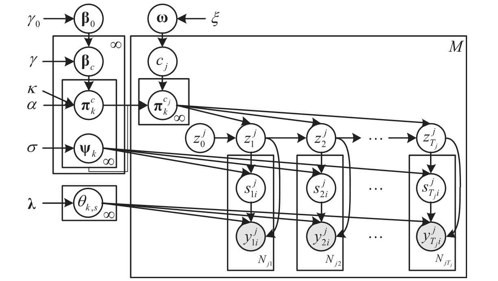

## 简介
&emsp;&emsp;在现实世界中，一幅图像/一段视频通常包含多个物体，这些物体有着非常丰富的颜色、形状和质地等属性，并且彼此间可能还存在着显式或隐式的相互作用，由此构成了多种复杂的场景和情境。让计算机充分地理解图像/视频是一件十分具有挑战性的事情，因为这要求计算机不仅能够实现空域/时域定位，语义识别以及属性分析，还要能够捕获多层次的实体交互，甚至要执行高层次的逻辑推理。近年来，学术界提出了一些研究任务来促进图像/视频的全面深入理解，比如行为识别、多标签识别和图像/视频描述。VSLab钻研图像/视频理解相关任务已有数年，在前沿技术方向上有着深入的研究基础，包括多示例学习、卷积神经网络、图神经网络、知识蒸馏等等。下面列出一些VSLab的代表性学术论文，并以行为识别和视频描述任务为例进行专题呈现。

## 专题
<html>
  

    

      
    

    

      <h4 class="mb-0 mt-4">
        <a href="/subpage/actionrecognition">行为识别</a>
      </h4>
        行为识别是指根据从包含行为的视频序列中提取特征进行分类，该技术可以应用到很多领域，比如视频分析，智能监控和人机交互等等。 当前使用的模型主要分为2D CNN 和3D CNN 两大类，但是他们各有优缺点。3D CNN可以实现高的准确率，却是要以巨大的计算成本为代价。2D CNN 虽然计算成本小，但是却损失了准确率。因此，当前的主要挑战是找到一种高效且有效的算法，可以从视频中提取出有代表性的特征。
    

  

</html>

<html>
  

    

      
    

    

      <h4 class="mb-0 mt-4">
        <a href="/subpage/videocaption">视频描述</a>
      </h4>
        视频描述是“视觉-语言”研究中最重要的一类生成式任务。通过对给定视频中动作和事件等内容的理解，自动地去生成符合人类语言习惯的描述。有很多非常有前景的应用，例如助盲系统可以帮助盲人读出这个世界，自动驾驶辅助系统可以帮助司机更好地判断路况。视频描述需要充分地利用视频中静止的表观信息和动态的运动信息，同时还需要跨越视觉-语言的鸿沟。因此两个重要的问题：一是如何更好地融合和利用视频中的多模态信息，以及如何将视觉信息和生成的语言匹配起来，是该任务需要解决的。
    

  

</html>

## 相关论文
<html>
  

    

      
    

    

      <h4 class="mb-0 mt-4">
        <a href="/publication/yang-2020-sta">STA-CNN: Convolutional spatial-temporal attention learning for action recognition [TIP2020]</a>
      </h4>
      卷积神经网络在图像目标识别方面取得了出色的成就。但是，与传统的用于识别视频中动作的方法相比，卷积神经网络的改进并不是那么重要，因为原始视频通常比静态图像具有更多的冗余或不相关信息。在本文中，我们提出了一种时空注意力卷积神经网络（STA-CNN），该网络选择区分性时间段并自动关注信息量大的空间区域。 STA-CNN模型将时间注意机制和空间注意机制合并到统一的卷积网络中，以识别视频中的动作。新颖的“时间注意机制”会自动从冗长且嘈杂的视频中挖掘出具有区别性的时间段。空间注意机制首先利用光流特征中的瞬时运动信息来定位运动显著区域，然后通过带有全局平均池化层的辅助分类损失对其进行训练，以专注于视频帧中的区分性非运动区域。 STA-CNN模型在两个最具挑战性的数据集UCF-101（95.8%）和HMDB-51（71.5%）上实现了最先进的性能。
    

  

</html>

<html>
  

    

      
    

    

      <h4 class="mb-0 mt-4">
        <a href="/publication/li-2020-anisotropic">Anisotropic convolution for image classification [TIP2020]</a>
      </h4>
      卷积神经网络建立在简单但有用的卷积模块上。传统的卷积因其固定的比例和几何结构而在特征提取和对象定位方面受到限制。此外，空间信息的丢失也限制了网络的性能和深度。为了克服这些限制，本文提出了一种新颖的各向异性卷积，在传统卷积中添加了比例因子和形状因子。各向异性卷积根据对象的有效大小灵活而动态地增强了感受野。另外，各向异性卷积是广义卷积：传统卷积，膨胀卷积和可变形卷积均可以视为其特例。此外，为了提高训练效率并避免陷入局部最优，本文介绍了各向异性卷积的简化实现。各向异性卷积可以应用于任意卷积网络，增强型网络称为ACN（各向异性卷积网络）。实验结果表明，在图像分类和对象定位任务中，尤其是在微小图像的分类任务中，ACN的性能优于许多最新方法和基线网络。
    

  

</html>

<html>
  

    

      
    

    

      <h4 class="mb-0 mt-4">
        <a href="/publication/liu-2019-knowledge">Knowledge distillation via instance relationship graph [CVPR2019]</a>
      </h4>
      知识蒸馏的关键挑战是从教师网络中提取通用、稳健和充足的知识，以指导学生网络。本文提出了一种新的实例关系图（IRG）进行知识提取。它对三种知识进行建模，包括实例特征，实例关系和特征空间转换，而后两种知识被先前的方法所忽略。首先，通过将实例特征和实例关系分别视为顶点和边，构造IRG来建模一个网络层的提取知识。其次，提出了一个IRG变换来建模跨层的特征空间变换。它比直接模仿中间层的特征要稳健。最后，hint损失函数旨在迫使学生的IRG模仿老师的IRG的结构。所提出的方法通过IRG有效地捕获了整个网络的知识，从而对不同的网络体系结构显示出稳定的收敛性和强大的鲁棒性。此外，所提出的方法在各种规模的数据集上均表现出优于现有方法的性能。
    

  

</html>

<html>
  

    

      
    

    

      <h4 class="mb-0 mt-4">
        <a href="/publication/hu-2018-dual">Dual sticky hierarchical Dirichlet process hidden Markov model and its application to natural language description of motions [TPAMI2018]</a>
      </h4>
      本文提出了一种新的非参数贝叶斯模型，称为双重粘性分层Dirichlet过程隐马尔可夫模型（HDP-HMM），用于从一系列时间序列数据（例如轨迹）中进行挖掘。HMM对与运动模式相对应的每个时间序列数据簇进行建模。我们的模型假设一组HMM具有相同的状态集（类似于用于文档处理的主题模型的主题），但是具有唯一的过渡分布。 HMM的数量和主题的数量都是自动确定的。粘性先验避免了冗余状态，使我们的HDP-HMM更有效地为多模式观测建模。对于运动轨迹建模的应用，主题对应于运动活动。学到的主题被聚集成原子活动，并为其分配谓词。我们提出一种贝叶斯推理方法，将给定的轨迹分解为一系列原子活动。场景中的源和汇是通过对轨迹的端点（起点和终点）进行聚类来学习的。使用轨迹中的点学习语义运动区域。将学习到的源和接收器，学习到的语义运动区域和学习到的原子活动序列组合在一起时，可以用自然语言尽可能自动地描述由轨迹表示的动作。我们的双粘性HDP-HMM的有效性在几个轨迹数据集上得到了验证。从交通场景中提取的车辆轨迹证明了自然语言描述对运动的有效性。
    

  

</html>

<html>
  

    

      
    

    

      <h4 class="mb-0 mt-4">
        <a href="/publication/li-2017-multi">Multi-view multi-instance learning based on joint sparse representation and multi-view dictionary learning [TPAMI2017]</a>
      </h4>
      在多实例学习（MIL）中，袋子中实例之间的关系在许多应用程序中传递了重要的上下文信息。先前关于MIL的研究要么忽略了这种关系，要么只是使用固定的图形结构对其建模，以致在复杂环境中整体性能不可避免地降低。为了解决这个问题，本文提出了一种新颖的多视图多实例学习算法（M2IL），该算法将袋子中的多个上下文结构组合到一个统一的框架中。新颖的方面是：(i) 我们提出了一个稀疏ε-图模型，该模型可以生成具有不同参数的不同图来表示袋子中的各种上下文关系；(ii) 我们提出了将这些图集成到其中的多视图联合稀疏表示。一个用于袋分类的统一框架，以及 (iii) 我们提出了一种多视图字典学习算法，以获得一种多视图图字典，该字典同时考虑了所有视图的提示，从而提高了对M2IL的区分度。在许多实际应用中的实验和分析证明了M2IL的有效性。
    

  

</html>

<html>
  

    

      
    

    

      <h4 class="mb-0 mt-4">
        <a href="/publication/peng-2016-salient">Salient object detection via structured matrix decomposition [TPAMI2016]</a>
      </h4>
      低秩重建模型显示出了显著物体检测的潜力，其中矩阵被分解为代表图像背景的低秩矩阵和识别显著物体的稀疏矩阵。但是，仍然存在两个缺陷。首先，先前的工作通常假设稀疏矩阵中的元素是相互独立的，而忽略了图像区域的空间和图案关系。其次，当低秩和稀疏矩阵相对一致时，例如，当显著对象与背景之间存在相似性或背景复杂时，以前的模型很难将它们解开。为了解决这些问题，我们提出了一种具有两个结构正则化的新颖结构化矩阵分解模型：（1）树状结构的稀疏诱导正则化捕获图像结构并强制来自同一对象的图像块具有相似的显著性值，以及（2）拉普拉斯正则化，可扩大特征空间中显著对象与背景之间的距离。此外，还集成了高级先验知识以指导矩阵分解并提高检测效率。我们在五个具有挑战性的数据集（包括单个对象，多个对象和复杂的场景图像）上评估了用于显著对象检测的模型，并在7个性能指标方面与24种最新方法相比显示了竞争性结果。
    

  

</html>
