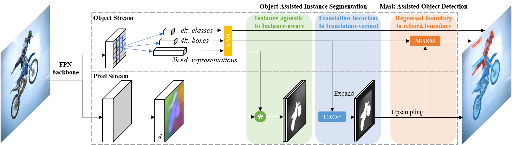
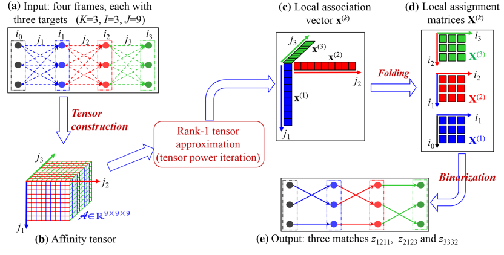
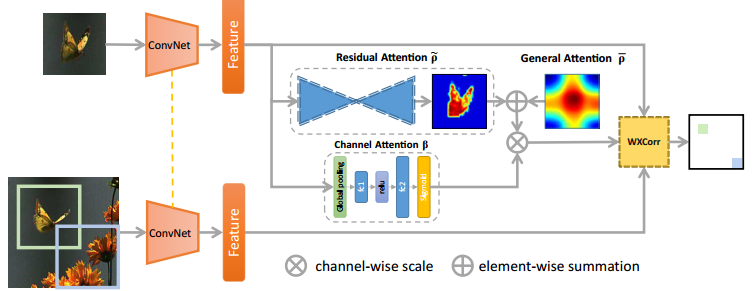
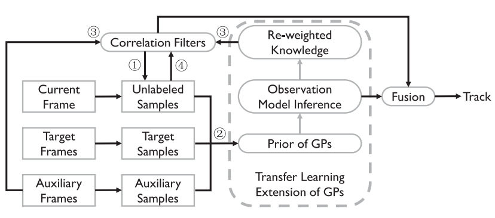
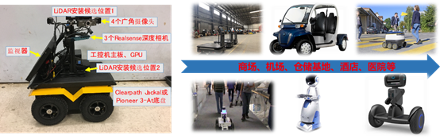
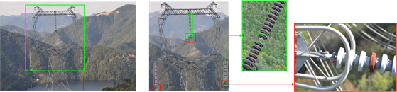

<!--  -->
## 简介
&emsp;&emsp;目标检测、跟踪、分割都是计算机视觉领域的基本任务，是视觉感知重要基础。目标检测旨在对图片中特定类别的物体完成识别与定位，跟踪任务则旨在预测视频序列中指定物体（一个或多个）的位置和形状。而对物体位置的表征并不局限于矩形框，可进一步以像素级分割图的形式表征物体位置，即实例分割与视频目标分割。上述技术广泛应用于机器人导航、智能视频监控、工业检测、视频编辑等多个领域。视频内容安全研究组在上述领域深耕多年，在理论研究、实践应用等方面均取得了丰厚的成果。  
## 奖项
- 2018年视频目标跟踪竞赛([VOT2018](https://www.votchallenge.net/vot2018/))实时通道冠军
- 2019年视频目标跟踪竞赛([VOT2019](https://www.votchallenge.net/vot2019/))RGBT通道亚军
- 2020年视频目标跟踪竞赛([VOT2020](https://www.votchallenge.net/vot2020/))实时通道和主通道亚军
- 2020年视频目标跟踪竞赛([VOT2020](https://www.votchallenge.net/vot2020/))RGBT通道实际冠军(由举办方重新测试VOT2019提交的跟踪器)
- 中国模式识别与计算机视觉大会PRCV 2020[**最佳论文奖**](/publication/zhou-2020-anchor/)
## 分享
- 王强: [SiamMask](https://www.bilibili.com/video/BV1Kt411u7CT?from=search&seid=14223038225505545546)
- 张志鹏: [Ocean](https://www.bilibili.com/video/BV1354y1e7wU?from=search&seid=10926703456041213142)
## 相关论文
<html>
  

    

      
    

    

      <h4 class="mb-0 mt-4">
        <a href="/publication/wang-2019-fast">SiamMask: Fast Online Object Tracking and Segmentation: A Unifying Approach [CVPR2019]</a>
      </h4>
        在本文中，我们提出了一种简单实时的算法同时完成视觉目标跟踪和半监督视频目标分割。我们将其称为SiamMask。在原本孪生网络的基础上，我们引入了一个单独的分割分支来预测物体的二值分割图。在离线训练后，只需要提供第一帧目标的矩形框，SiamMask就可以以55fps的速度生成目标无关的二值分割图以及旋转矩形框。尽管网络结构设计简单，我们的跟踪器取得了当前VOT2018数据集上的最好效果，并且在视频分割任务中我们取得了最快的运行速度。
    

  

</html>

<html>
  

    

      
    

    

      <h4 class="mb-0 mt-4">
        <a href="/publication/zhang-2020-ocean">Ocean: Object-aware Anchor-free Tracking [ECCV2020]</a>
      </h4>
        近年来，基于acnhor的孪生网络在跟踪准确性方面取得了显着进步，但是其鲁棒性仍然进步缓慢。我们发现根本原因是基于anchor的方法中的回归网络仅训练正样本，忽略了和目标框重合度较小的anchor。在本文中，我们提出了基于anchor-free的新框架来解决这个问题。在目标尺度预测过程中，我们直接预测参考点到目标框四个边的距离，不再使用anchor作为参考。由于目标框中的每个像素均参与了训练，因此跟踪器能够在推理过程中纠正不精确目标框预测。另外，我们在分类网络中引入了特征对齐模块来学习target-aware的特征。实验表明，我们的算法在五个评测库上均达到了领先性能。
    

  

</html>

<html>
  

    

      
    

    

      <h4 class="mb-0 mt-4">
        <a href="/publication/wang-2020-rds-net-an">RDSNet: A New Deep Architecture for Reciprocal Object Detection and Instance Segmentation [AAAI2020]</a>
      </h4>
        目标检测与实例分割是计算机视觉领域的两项基础任务。它们关系密切，但其关联却很少被研究。本文提出了一种目标检测与实例分割的联合框架，充分利用了两种任务之间的互惠关系，目标检测任务可为实例分割任务提供更充分的物体实例级特征，而反过来实例分割任务可为目标检测提供更精确的定位信息。为此，本文提出了一种双流卷积神经网络，两条分支以不同的网络结构设计侧重提取不同级别的图像特征，并通过若干精心设计的模块实现信息传递与融合。最终在通用数据集上，实验证明我们的方法确实可以有效利用两个任务间的互惠关系，以更快的速度达到了更高的精度。 
    

  

</html>

<html>
  

    

      
    

    

      <h4 class="mb-0 mt-4">
        <a href="/publication/shi-2019-rank">Rank-1 Tensor Approximation for High-Order Association in Multi-target Tracking [IJCV2019]</a>
      </h4>
        高阶运动信息在多目标跟踪中非常重要，尤其是在处理较大的目标模糊时。高阶信息可以自然地建模为多维分配（MDA）问题，但是很难求其全局最优解。在本文中，我们通过将多目标跟踪重塑为秩1张量逼近问题（R1TA），提出了一个新的框架。我们首先证明了MDA和R1TA具有相同的目标函数和相似的约束。这一发现打开了使用高阶张量分析进行MTT的大门。在本文中，我们提出了张量幂迭代算法来有效捕获高阶运动信息以及外观变化。我们将提出的算法是在不同类型的数据集上进行评估，证明了算法的有效性。
    

  

</html>

<html>
  

    

      
    

    

      <h4 class="mb-0 mt-4">
        <a href="/publication/wang-2018-learning">Learning Attentions: Residual Attentional Siamese Network for High Performance Online Visual Tracking [CVPR2018]</a>
      </h4>
        基于离线训练的算法近期在平衡目标跟踪速度和性能上显示出了巨大潜力。然而，离线训练的跟踪器仍难以很好适应在线训练过程中目标外观和环境变化。在本文中，我们提出了一个基于残差的注意力网络（RASNet）用于高性能目标跟踪。 RASNet模型在孪生跟踪框架内重构相关过滤器，并引入了空间和通道注意机制来适应目标和环境的变化。注意力的引入增强了目标的表征能力，提高了跟踪的精度。
    

  

</html>

<html>
  

    

      
    

    

      <h4 class="mb-0 mt-4">
        <a href="/publication/gao-2018-tracking">Tracking-by-Fusion via Gaussian Process Regression Extended to Transfer Learning [TPAMI2018]</a>
      </h4>
        本文提出了一个基于高斯过程（GPs）的粒子过滤器跟踪框架。该框架将高斯过程回归（GPR）应用到迁移学习中。根据融合-跟踪的策略，我们引入了GPs和CFs两个跟踪模块。GP模块通过利用高斯过程来分析和建模目标外观的概率分布。它将标记的样本分为辅助样本和目标样本，并在迁移学习中探索未标记的样本。因此，GPs模块会随时间增加捕获目标样本上丰富的外观信息。另一方面，通过粒子滤波方法对高可能性区域中的初始粒子集进行采样，我们集成了功能强大而有效的相关滤波器，即CFs模块。CFs模块不仅提高了采样质量，还受益于GPs模块提供的重新加权的知识作为潜在变量，用于确定辅助样本中每个相关滤波器模板的影响。
    

  

</html>

## 项目
<html>
  

    

      
    

    

      <h4 class="mb-0 mt-4">
        <a href="/subpage/p1-1">基于多源数据的感知对象快速精准分割、检测及跟踪-识别</a>
      </h4>
        复杂场景下感知对象存在找不到、定不准、认不清等问题,基于多源传感的环境感知是解决这一问题的重要方法。由于异构传感器具有不同的数据结构、感知对象表观复杂多样，导致多源异构感知对象的准确提取与结构化表示难度大。同时，分割、检测、跟踪、识别等感知任务间协同度不足，不能够有效利用感知任务间的相关性进一步提升感知性能。只有充分利用多源异构数据的互补性、协同不同感知任务，才能够实现复杂场景下对象快速精准感知。针对上述问题，研究团队提出了如SiamMask、RDSNet等算法及框架，实现了多种目标感知任务的协同一体化。
    

  

</html>

<html>
  

    

      
    

    

      <h4 class="mb-0 mt-4">
        <a href="/subpage/p1-2">面向工业应用场景的缺陷智能识别</a>
      </h4>
        缺陷智能识别被广泛应用于工业生产、设备维护等实际场景，可有效降低人力成本，提升作业安全。研究团队致力于将图像处理、目标识别等学术前沿技术应用于工业实际应用场景。例如：研究团队主导完成了面向电力系统的智能缺陷检测系统，对直升机巡视拍摄的铁塔高清图像进行自动部件缺陷识别。针对此实际应用场景，团队提出了基于候选区域主机检测的技术路线，并最终实现了包含全景图像标注工具、缺陷智能识别算法、缺陷数据浏览处理分析软件、识别算法端侧部署的全套解决方案，极大提升了巡检的缺陷发现率，并降低了人工作业成本。
    

  

</html>

<html>
  

    

      <video src="demo3.mp4" width="" height="" controls="controls"></video>
    

    

      <h4 class="mb-0 mt-4">
        <a href="/subpage/p1-3">面向复杂场景下的稳定实时精准目标跟踪</a>
      </h4>
        在现实的跟踪过程中，受到环境中光照，背景，干扰物的影响，跟踪器容易失效。在设计跟踪器时，精度，稳定性和实时性通常作为做主要的关注点。针对这些难点问题，研究团队提出了多种有效手段。比如，我们将注意力机制引入孪生网络中(RASNet)提高了跟踪精度，将无锚框机制(Ocean)引入提高跟踪器的稳定性。相关算法在众多国际目标跟踪竞赛中均取得了优异的成绩。
    

  

</html>
