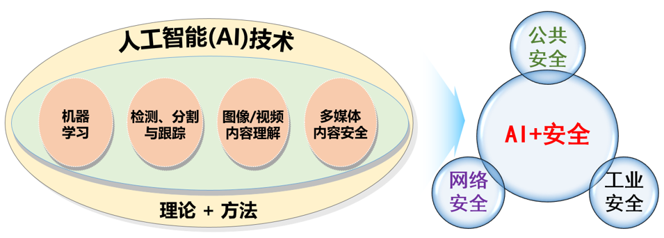

+++
widget = "blank"
headless = true  # This file represents a page section.
active = true  # Activate this widget? true/false
weight = 5  # Order that this section will appear in.
title = ""

[design]
  # Choose how many columns the section has. Valid values: 1 or 2.
  columns = "1"

[design.spacing]
  # Customize the section spacing. Order is top, right, bottom, left.
  padding = ["30px", "150px", "0", "150px"]

[design.background]
  color = "white"

+++

<html>
  

    

      <h2>研究简介</h2>
      多年来，视频内容安全研究组围绕核心主题“AI+安全”开展了诸多具有高学术价值的基础理论和创新方法研究。我们所研究的AI技术可大致分为四个课题方向：机器学习、检测分割与跟踪、图像/视频内容理解、多媒体内容安全。并且，我们所研发的技术与系统已成功地应用于多个现实场景中，为社会安全的各个方面提供了切实保障，包括公共安全（安防监控）、网络安全（有害内容识别）和工业安全（缺陷检测）等。未来，我们将围绕“AI+安全”的主题持续深耕，学术上以研究突破性的AI理论方法为目标，应用上探索更多“安全”实用的可能性。
    

    

      
    

  

</html>

## 研究课题
