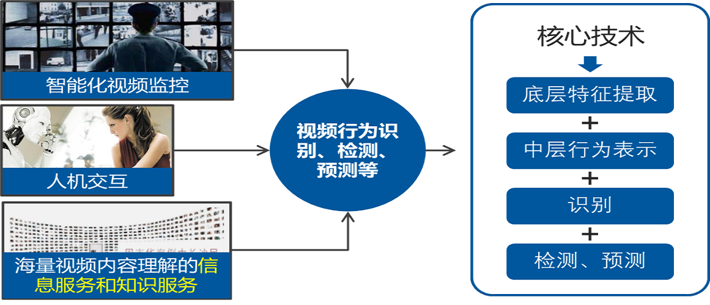
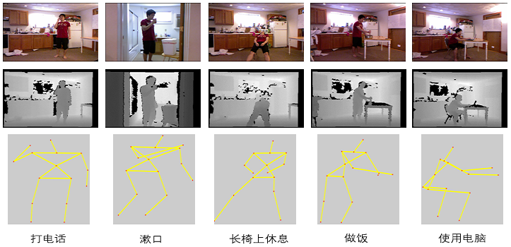
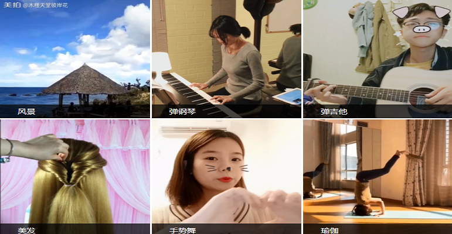
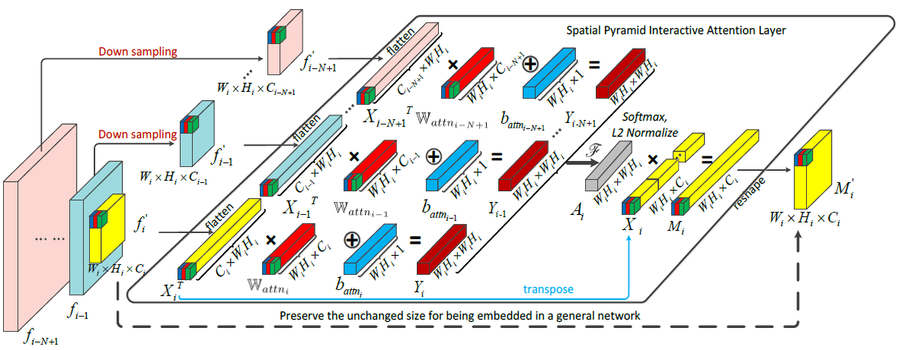
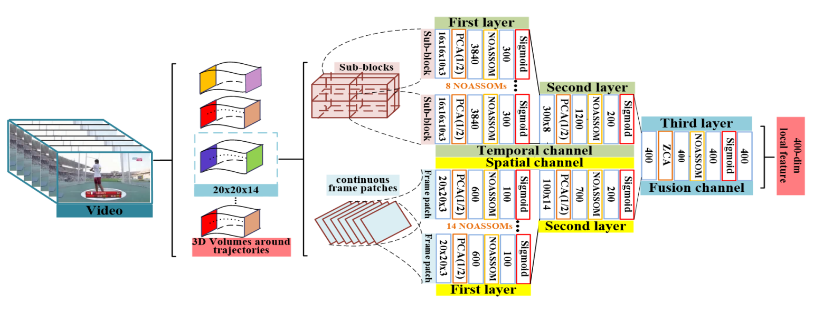
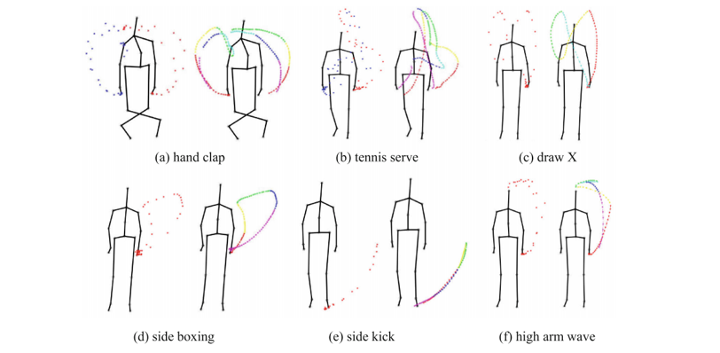
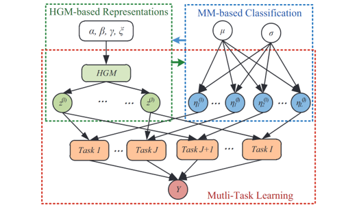
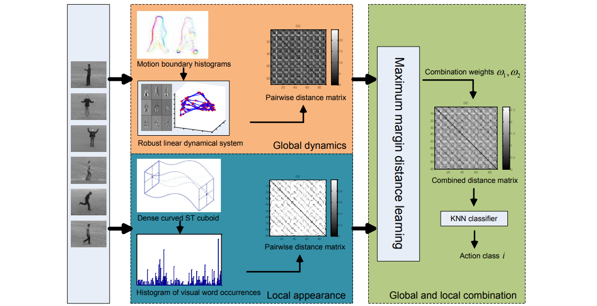

+++
widget = "blank"
headless = true  # This file represents a page section.
active = true  # Activate this widget? true/false
weight = 10  # Order that this section will appear in.
title = ""

[design]
  # Choose how many columns the section has. Valid values: 1 or 2.
  columns = "1"

[design.spacing]
  # Customize the section spacing. Order is top, right, bottom, left.
  padding = ["50px", "100px", "0", "100px"]

[design.background]
  color = "white"

+++
# 行为识别

<html>
  

    

      
    

    

      

        &emsp;&emsp;行为识别是指根据从包含行为的视频序列中提取特征进行分类，该技术可以应用到很多领域，比如视频分析，智能监控和人机交互等等。当前使用的模型主要分为2D CNN 和3D CNN 两大类，但是他们各有优缺点。3D CNN可以实现高的准确率，却是要以巨大的计算成本为代价。2D CNN 虽然计算成本小，但是却损失了准确率。因此，当前的主要挑战是找到一种高效且有效的算法，可以从视频中提取出有代表性的特征。针对面临的问题，我们团队在这个领域探索了多年，提出了很多模型和方法，包括CNN，线性动态系统，树模型图匹配，图卷积网络等等。

    

  

</html>

## 项目

<html>
  

    

      
    

    

      <h4 class="mb-0 mt-4">
        基于多任务稀疏学习的视频行为理解
      </h4>
        现有的视频行为理解主要集中在行为分类和识别上，对于行为检测特别是预测的研究相对较少。本团队将视频行为理解的研究从单纯的行为识别扩展到对行为进行识别的同时实现检测和预测；从分割好的仅包含一种行为的短视频提升到包含多人多种行为的复杂长视频的研究；从离线的分类处理到在线的检测预测处理；从理论研究为主要目标发展到越来越关注在实际中的应用价值。研究了底层特征提取、中层视频行为表示、高层行为检测、预测，实现了基于多任务稀疏学习的行为理解。
    

  

</html>

<html>
  

    

      
    

    

      <h4 class="mb-0 mt-4">
        基于RGB-D视频的多模态人体行为识别
      </h4>
        随着深度采集设备的出现和普及，基于RGB-D数据的行为识别正在成为计算机视觉领域的一个新的研究热点。本团队针对RGB、深度、骨骼三种模态展开基于多模态的人体行为识别研究。实现了层级自适应子空间自组织神经网络的RGB视频行为识别、基于R变换与高效3D卷积神经网络结合的深度视频行为识别、基于交互感知注意力图卷积神经网络的骨骼视频行为识别、基于多样性子网络动态集成的多模态融合行为识别等方法及相关应用。相比RGB单一模态，多模态融合促进了行为识别性能的大幅度提高，带来更广阔的应用空间。
    

  

</html>

<html>
  

    

      
    

    

      <h4 class="mb-0 mt-4">
        美图短视频实时分类挑战赛
      </h4>
        本团队与美图公司合作，建立了一个短视频数据集（MTSVRC数据集）。该数据集共有100,000个视频，其中训练集有50,000个视频，验证集和测试集分别有25,000个视频，以短视频为主，长度约为5 - 15s。数据集包含50个分类，视频类别包括舞蹈、唱歌、手工、健身等热门短视频类型，除了包含与人相关的一些行为类别，还有一些风景，宠物等类别。2018年5月，本团队基于此数据集，联合美图公司、中国模式识别与计算机视觉学术会议（PRCV2018）共同举办了PRCV2018“美图短视频实时分类挑战赛”。不同于以往只关注分类精度的比赛，本竞赛综合考察“算法准确率”和“实时分类”两个方面，将运行时间作为重要指标参与评估，将促进视频分类算法在工业界的应用。
    

  

</html>

<html>
  

    

      <video src="demo.mp4" width="" height="" controls="controls"></video>
    

    

      <h4 class="mb-3 mt-4">
        <a href="/zh/subpage/p2-1">实验室动物行为分析</a>
      </h4>
      <ul>
        <li>实验室动物行为的观察和分析广泛用于神经科学和药理学研究。大鼠和小鼠是常见的动物模型，可用于研究遗传变异，药物治疗，光遗传学刺激和其他干预措施的行为影响。</li>
        <li>人工观察记录的成本高昂：实验人员能够同时关注的目标有限，难以长时间连续工作，在动作记录的精确性上也很难保证。</li>
        <li>自动化检测、定位与分类评估系统可以有效突破上述限制：任意数量目标同时观察，7*24小时连续记录，精确到分秒捕捉全时段动物行为的变化。</li>
        <li>适配不同的实验环境和动物类型，从小动物（鼠）到大动物（猴），从单目标到群体目标，实时捕捉并输出分析结果。</li>
      </ul>
    

  

</html>

## 相关论文
<html>
  

    

      
    

    

      <h4 class="mb-0 mt-3">
        <a href="/zh/publication/yang-2020-sta">STA-CNN: Convolutional spatial-temporal attention learning for action recognition [TIP2020]</a>
      </h4>
        卷积神经网络在图像目标识别方面取得了出色的成就。但是，与传统的用于识别视频中动作的方法相比，卷积神经网络的改进并不是那么重要，因为原始视频通常比静态图像具有更多的冗余或不相关信息。在本文中，我们提出了一种时空注意力卷积神经网络（STA-CNN），该网络选择区分性时间段并自动关注信息量大的空间区域。 STA-CNN模型将时间注意机制和空间注意机制合并到统一的卷积网络中，以识别视频中的动作。新颖的“时间注意机制”会自动从冗长且嘈杂的视频中挖掘出具有区别性的时间段。空间注意机制首先利用光流特征中的瞬时运动信息来定位运动显著区域，然后通过带有全局平均池化层的辅助分类损失对其进行训练，以专注于视频帧中的区分性非运动区域。 STA-CNN模型在两个最具挑战性的数据集UCF-101（95.8%）和HMDB-51（71.5%）上实现了最先进的性能。
    

  

</html>

<html>
  

    

      
    

    

      <h4 class="mb-0 mt-0">
        <a href="/zh/publication/du-2018-interaction">Interaction-aware spatio-temporal pyramid attention networks for action classification [ECCV2018]</a>
      </h4>
        深度卷积神经网络得到的特征图中，相邻空间位置的局部通道特征由于感受野重叠导致往往具有很高的相关性。自注意机制模型通常通过每个局部特征内部元素的加权和（或其他函数）来计算其权重得分，然后利用此权重加权所有局部特征获取关键特征。但是此权重的计算没有考虑局部特征之间的相互作用，尽管它们具有很高的相关性。本文提出一种新的基于交互感知的注意力神经网络，借鉴PCA的思想来指导注意力模型的学习，将PCA算法转换成损失函数实现交互感知的注意机制。另外，利用深度网络中不同层捕获的不同尺度的特征图构造一个空间金字塔，利用多尺度信息来计算每个局部通道特征更精确的注意力分数。基于交互感知的空间金字塔注意力模型不受其输入特征图数量的限制，可以扩展到兼容任意数量输入图像的时空版本。
    

  

</html>

<html>
  

    

      
    

    

      <h4 class="mb-0 mt-0">
        <a href="/zh/publication/du-2018-hierarchical">Hierarchical nonlinear orthogonal adaptive-subspace self-organizing map based feature extraction for human action recognition [AAAI2018]</a>
      </h4>
        特征提取是行为识别任务中的关键步骤。手工设计的特征往往因为其固定的形式而受到限制，而深度学习特征虽然更有效，但需要大规模的标签数据进行训练。在本文中，我们提出了一种新的分层非线性正交自适应-子空间自组织映射(NOASSOM)，可以在无监督的情况下从数据中自适应地学习有效的特征。NOASSOM是在自适应子空间自组织映射(ASSOM)的基础上扩展而来的，ASSOM只处理线性数据，并通过标记数据进行监督训练。首先，我们在ASSOM中增加非线性正交映射层，使得NOASSOM能够处理非线性输入数据，并且避免了用核方法定义非线性正交映射的具体形式。其次，我们对ASSOM的损失函数进行了修改，使每个输入样本都被单独用来训练模型。在这种方式下，NOASSOM可以在无需监督的情况下有效地从数据中学习统计模式。第三，我们提出了一个分层的NOASSOM，以提取更多的代表性特征。最后，我们应用所提出的分层NOASSOM有效地描述轨迹周围的外观和运动信息用于行为识别。
    

  

</html>

<html>
  

    

      
    

    

      <h4 class="mb-0 mt-0">
        <a href="/zh/publication/wang-2016-graph">Graph based skeleton motion representation and similarity measurement for action recognition [ECCV2016]</a>
      </h4>
        目前三维人体行为表示无法有效的保留不同行为内部独特的时空特征，且对深度采集设备所采集的数据鲁棒性不强。对于行为相似性的度量，目前存在的方法又缺乏一定的语义性，且不能刻画不同行为内部特征之间的关系。针对以上问题，我们提出了一种基于图结构的人体行为表示模型，并且进一步提出了一种基于子图分解的图结构相似性度量方式。在构建人体行为表示时，我们首先对每个关节点的轨迹进行预处理，然后将其分段，每个片段是一个子行为在特定时空域下的抽象。由于对轨迹的预处理，这些片段对噪声是鲁棒的。由于图可以很好的刻画数据之间的结构关系，我们将每个行为建模为一个时空图。图的顶点表示一个子行为，图的边描述了它们的时空关系，一个子图代表一个行为片段，因此我们的行为表示具有一定的语义性。基于此，我们进一步提出了一种基于子图分解的图核。图首先被分解为不同的子结构群，通过度量不同子结构群的相似性，我们度量了图的相似性，而子结构群的相似性度量，对应行为片段的相似性度量，所以我们的图核同样具有一定的语义性。
    

  

</html>

<html>
  

    

      
    

    

      <h4 class="mb-0 mt-0">
        <a href="/zh/publication/yang-2015-multi">Multi-feature max-margin hierarchical Bayesian model for action recognition [CVPR2015]</a>
      </h4>
        本文提出了一种用于动作识别的多特征最大边距层次贝叶斯模型（M^3 HBM）。与现有的方法将表示和分类分离成两个步骤不同，M^3 HBM通过将分层生成模型(HGM)和判别性最大余量分类器结合在一个统一的贝叶斯框架中，共同学习一个高级表示。具体来说，HGM被提出用于表示动作的分布，这些分布是由多个特征模式学习的，并在不同的类中共享。在识别方面，我们采用吉布斯分类器来最小化基于最大边际原则的预期损失函数，并将分类器作为M^3 HBM的正则化项，在学习STPs的同时对分类器参数进行贝叶斯估计。此外，我们还应用了多任务学习，从多个特征模态中学习不同类的模型。对于测试视频，我们通过推理获得表征，并通过学习的吉布斯分类器进行动作识别。对于学习和推理过程，我们推导出一个高效的吉布斯采样算法来解决提出的M^3 HBM。我们在多个数据集上进行了大量的实验，证明了我们的方法在动作识别方面的表示和分类能力。
    

  

</html>

<html>
  

    

      
    

    

      <h4 class="mb-0 mt-0">
        <a href="/zh/publication/luo-2014-learning">Learning human actions by combining global dynamics and local appearance [TPAMI2014]</a>
      </h4>
        在本文中，我们通过结合全局时序动态特征和局部视觉时空表观特征来解决人体动作识别的问题。为此，在全局时间维度上，我们提出用鲁棒线性动力学系统（LDSs）对运动信息进行建模并将模型参数作为运动描述子。由于LDSs处于一个非欧几里得空间中并且描述子是非矢量形式的，我们提出了一个基于平移不变子空间角度的距离来衡量LDSs之间的相似性。在局部视觉维度上，我们沿着密集采样的特征点轨迹构建时空立方体，并使用定向梯度直方图（HOG）来描述它们。运动序列之间的距离是用词包框架中的Chi-Squared直方图距离计算出来的。最后我们结合全局动态距离和局部视觉距离，使用最大余量距离学习方法进行分类。我们在五个短视频数据集以及三个长视频数据集上评估了我们的方法。我们的方法展示出与目前最先进的方法相比具有竞争力的结果。
    

  

</html>
