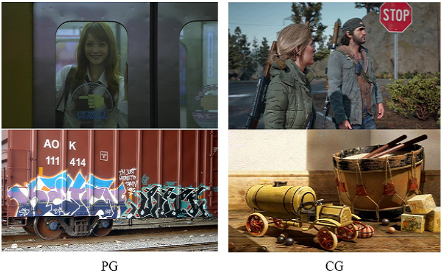

+++
widget = "blank"
headless = true  # This file represents a page section.
active = true  # Activate this widget? true/false
weight = 10  # Order that this section will appear in.
title = ""

[design]
  # Choose how many columns the section has. Valid values: 1 or 2.
  columns = "1"

[design.spacing]
  # Customize the section spacing. Order is top, right, bottom, left.
  padding = ["50px", "100px", "0", "100px"]

[design.background]
  color = "white"

+++
# 人脸伪造检测
&emsp;&emsp;随着渲染技术和深度学习的发展，逼真数字图像内容的改动和生成技术取得了突破。计算机生成（CG）图像与摄影（PG）图像之间越来越难以区分。其中深度伪造换脸技术主要借助生成对抗网络拟合真实人脸图像的分布，将一张源图像中的人脸换为指定目标的身份，并且保持姿态、表情等属性不变，达到了以假乱真的程度。合成图像的肆意传播可能会对公众产生误导，因此非常有必要研究相应的算法鉴别图像是否是虚假合成品。CG图像鉴伪任务即主要致力于区分CG和PG图像。特别地，假脸鉴别专门针对人脸场景。  
&emsp;&emsp;现有的CG图像鉴伪工作在区分高质量的CG图像和PG图像方面仍然存在困难。主要原因是现有的数据集已经过时，并且鉴伪方法忽略了底层纹理的差异等重要信息。为了解决该问题，我们首先构建一个具有高多样性和低偏差的CG和PG图像大规模数据集。在此基础上，提出了一种纹理感知的CG和PG图像分类方法，该方法考虑了主干特征图输出中滤波器之间的相关性。大量的实验证明了其有效性。  
&emsp;&emsp;同样，假脸鉴别方法也存在待解决问题：一是鉴别算法不易对未知新型造假方法保持较高的检测准确率，即泛化性能不足。二是鉴别算法的性能容易受到常规图像处理手段的干扰，在实际应用中缺乏鲁棒性。三是对伪造线索的本质认识不足，鉴别算法所习得的鉴伪依据尚无明确的解释，因此难以设计启发式策略。我们认为应从造假手段中总结共性，例如相同的模块结构、后处理方法等，由此针对性地设计检测方案，使之对更多造假类型都具备高准确率。我们正探究更多地利用脸部本身所携带的高层语义对鉴别效果有何种影响，期望对人脸伪造问题的本质有更深刻认识。

<html>
  

    

      
    

    

      <video src="demo.mp4" width="" height="" controls="controls"></video>
      

      
人脸伪造检测示例（欧阳夏丹/刚强<a href=https://github.com/deepfakes/faceswap>换脸</a>）

      

    

  

</html>
