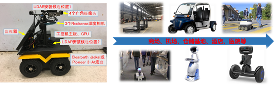

+++
widget = "blank"
headless = true  # This file represents a page section.
active = true  # Activate this widget? true/false
weight = 10  # Order that this section will appear in.
title = ""

[design]
  # Choose how many columns the section has. Valid values: 1 or 2.
  columns = "1"

[design.spacing]
  # Customize the section spacing. Order is top, right, bottom, left.
  padding = ["60px", "0", "0", "0"]

[design.background]
  color = "white"

+++
# 基于多源数据的感知对象快速精准分割、检测及跟踪-识别
<html>
  

    

    

    

       
    

  

</html>

复杂场景下感知对象存在找不到、定不准、认不清等问题,基于多源传感的环境感知是解决这一问题的重要方法。由于异构传感器具有不同的数据结构、感知对象表观复杂多样，导致多源异构感知对象的准确提取与结构化表示难度大。同时，分割、检测、跟踪、识别等感知任务间协同度不足，不能够有效利用感知任务间的相关性进一步提升感知性能。只有充分利用多源异构数据的互补性、协同不同感知任务，才能够实现复杂场景下对象快速精准感知。针对上述问题，研究团队提出了如SiamMask、RDSNet等算法及框架，实现了多种目标感知任务的协同一体化。
