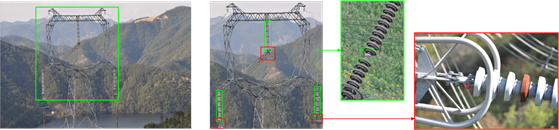

+++
widget = "blank"
headless = true  # This file represents a page section.
active = true  # Activate this widget? true/false
weight = 10  # Order that this section will appear in.
title = ""

[design]
  # Choose how many columns the section has. Valid values: 1 or 2.
  columns = "1"

[design.spacing]
  # Customize the section spacing. Order is top, right, bottom, left.
  padding = ["50px", "100px", "0", "100px"]

[design.background]
  color = "white"

+++
# 面向工业应用场景的缺陷智能识别
<html>
  

    

    

    

       
    

  

</html>

缺陷智能识别被广泛应用于工业生产、设备维护等实际场景，可有效降低人力成本，提升作业安全。研究团队致力于将图像处理、目标识别等学术前沿技术应用于工业实际应用场景。例如：研究团队主导完成了面向电力系统的智能缺陷检测系统，对直升机巡视拍摄的铁塔高清图像进行自动部件缺陷识别。针对此实际应用场景，团队提出了基于候选区域主机检测的技术路线，并最终实现了包含全景图像标注工具、缺陷智能识别算法、缺陷数据浏览处理分析软件、识别算法端侧部署的全套解决方案，极大提升了巡检的缺陷发现率，并降低了人工作业成本。
