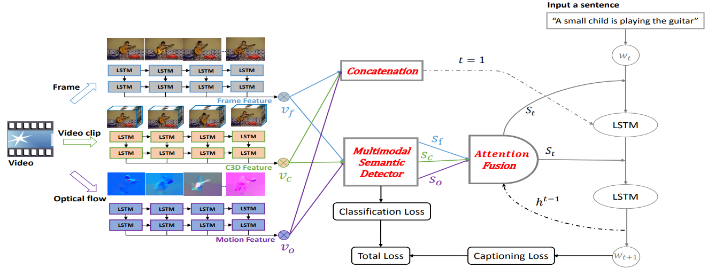

+++
widget = "blank"
headless = true  # This file represents a page section.
active = true  # Activate this widget? true/false
weight = 10  # Order that this section will appear in.
title = ""

[design]
  # Choose how many columns the section has. Valid values: 1 or 2.
  columns = "1"

[design.spacing]
  # Customize the section spacing. Order is top, right, bottom, left.
  padding = ["50px", "100px", "0", "100px"]

[design.background]
  color = "white"

+++
# 视频描述
## 简介
&emsp;&emsp;视频描述是“视觉-语言”研究中最重要的一类生成式任务。通过对给定视频中动作和事件等内容的理解，自动地去生成符合人类语言习惯的描述。有很多非常有前景的应用，例如助盲系统可以帮助盲人读出这个世界，自动驾驶辅助系统可以帮助司机更好地判断路况。视频描述需要充分地利用视频中静止的表观信息和动态的运动信息，同时还需要跨越视觉-语言的鸿沟。因此两个重要的问题：一是如何更好地融合和利用视频中的多模态信息，以及如何将视觉信息和生成的语言匹配起来，是该任务需要解决的。  
&emsp;&emsp;之前的经典方法，如S2VT, SA-LSTM, h-RNN虽然可以获得较好的效果，但是这些方法都只用到关键帧和关键片段的表观信息和运动信息，这些全局信息不能很好地提取视频中细粒度的物体信息。这与我们人类观察一段视频时，更多地关注视频中的物体有较大的差距。在这个项目中，我们构建了物体关系图网络，在物体关系推理的过程中丰富物体的表征，从而为视频描述增加丰富的细节信息。此外，单靠有限的训练样本是很难将如此复杂的系统训练好的。因此，我们利用预训练的大型语言模型，将外部语言知识引入描述模型，帮助模型更好地习得语言常识。在上述方法的支撑下，我们在多个公开数据集MSVD，MSR-VTT，VATEX都获得当时最好的性能。  

## 竞赛
- [ICCV2019 VATEX](https://arxiv.org/pdf/1910.05752.pdf)视频描述挑战赛中/英文双赛道冠军
## 演示
<html>
  

    

      <video src="demo1.mp4" width="" height="" controls="controls"></video>
    

    

      中文描述： 
      一群人在人行横道上躲着车过马路。 
      一个个的行人正在急匆匆的穿过马路。 
      有人在交叉行走时记录了车辆经过的过程。 
      在一个繁忙的城市里，人们站着等着过马路。 
      白色的车辆从马路上驶过，人们快速走过斑马线。 
      一辆白色汽车在人来人往的马路上开动，三个人正在横过斑马线。 
      一辆白色长车开过，而后一辆小车也开过，三个人站在斑马线等着过马路。 
    

  

</html>

## 相关论文
<html>
  

    

      
    

    

      <h4 class="mb-0 mt-0">
        <a href="/publication/zhang-2020-object">Object Relational Graph with Teacher-Recommended Learning for Video Captioning [CVPR2020]</a>
      </h4>
        充分利用视觉和语言信息对视频描述任务至关重要。由于忽略了对象之间的交互，现有模型缺乏足够的视觉表示，并且由于长尾问题而缺乏对与内容相关的单词的充分训练。在本文中，我们提出了一个包括模型和高效训练策略在内的完整的视频描述系统。具体来说，我们提出了一种基于对象关系图（ORG）的编码器，该编码器捕获了更详细的交互特征以丰富视觉表示。同时，我们设计了一种教师推荐学习（TRL）方法，以充分利用成熟的外部语言模型（ELM）将丰富的语言知识整合到视频描述模型中。ELM生成了在语义上更相似的单词建议，这些单词建议扩充了用于训练的单词来处理长尾问题。MSVD，MSR-VTT和VATEX上的实验结果表明，所提出的ORG-TRL系统达到了最先进的性能，消融实验和可视化进一步说明了我们系统的有效性。
    

  

</html>

<html>
  

    

      
    

    

      <h4 class="mb-0 mt-0">
        <a href="/publication/sun-2019-multimodal">Multimodal semantic attention network for video captioning [ICME2019]</a>
      </h4>
      受到视频中不同模态包含互补信息这一事实的启发，我们提出了一种多模态语义注意网络（MSAN），它是一种新的编码-解码器框架，结合多模态语义属性用于视频描述。在编码阶段，我们将其视为多标签分类问题来检测并生成多模态语义属性。此外，我们在模型中添加了辅助分类损失，可以获得更有效的视觉特征和高层多模态语义属性分布以进行视频编码。在解码阶段，我们将常规LSTM的每个权重矩阵扩展为一组与属性相关的权重矩阵，并采用注意机制在每次视频描述时注意不同的属性。MSVD和MSR-VTT上的6种评价指标表明我们的方法取得了与先进方法相当的性能。
    

  

</html>
